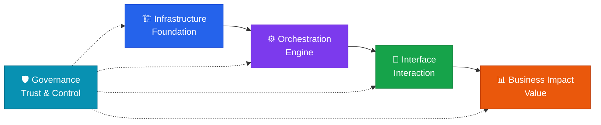


  

  Open framework
  



  AI Engineering&nbsp; Framework



  A practical framework for managing AI technology&nbsp; across five domains, from foundation to business value.





  
  
  
  
  


## The Value Chain

AI technology is not managed as five isolated topics — it moves through a single chain that turns technical foundations into measurable business value, with governance acting as a control layer across every stage.

- **Infrastructure** is the foundation everything else is built on — compute, models, data, and context management.
- **Orchestration** is the engine that turns that foundation into working systems — prompts, retrieval, agents, workflows.
- **Interface** is where those systems meet people — design, modality, literacy, feedback.
- **Business Impact** is where all of the above is converted into measurable value — ROI, speed, new business models, scale.
- **Governance** does not sit at the end of the chain; it wraps every stage with guardrails, observability, auditability, cost control, and compliance.

