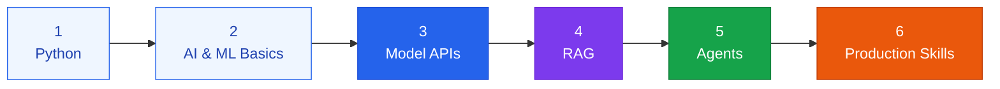

The **AI Engineering** framework organizes the practice of building, running, and governing AI systems into five domains. Together they form a value chain — from technical foundation, through the systems that put it to work, to the people who use it and the value it creates — with governance wrapping every stage.

<!--more-->


  
  
  
  
  


## Who Does This Work

Three roles get lumped together as "AI jobs," but they build different things:

| Role | What they build | Day-to-day focus |
|---|---|---|
| **AI Researcher** | New algorithms and model architectures | Novel training methods, papers, benchmark design |
| **ML Engineer** | Models trained from scratch on their own data | Feature pipelines, training runs, model serving |
| **AI Engineer** | Products built on models that already exist — GPT, Claude, Llama | APIs, retrieval, agents, evaluation, cost, safety |

This framework is written for the third role. It treats the model as a component that already works, so the engineering problem is everything around it: what you feed it, what you let it do, who uses it, what it costs, and how you keep it in bounds.

## Learning Progression

The five domains are organized by architecture, not by difficulty. If you are building the skill set rather than looking up a specific topic, work through it in this order instead:

| Stage | What you learn | Where this framework covers it |
|---|---|---|
| **1. Python** | Variables, control flow, functions, data structures, file I/O, working with libraries | Prerequisite — assumed by every code example on this site |
| **2. AI & ML basics** | How machine learning and neural networks work; what an LLM actually does (next-token prediction); prompting; why hallucinations happen | [AI Model Fundamentals](infrastructure/models), [Prompt & Context Design](orchestration/prompt-design), [AI Literacy Education](interface/ai-literacy) |
| **3. Model APIs** | Talking to a model from code rather than a chat window; structured outputs; function calling | [Agent Interface](orchestration/agent-interface), [Model Selection & Tuning](infrastructure/model-selection) |
| **4. RAG** | Chunking and embedding your own documents so the model can answer from information it was never trained on | [RAG Pipeline](orchestration/rag), [RAG 2.0](orchestration/rag-2-0), [Vector DB Optimization](infrastructure/vector-db) |
| **5. Agents** | Goals, multi-step planning, calling tools and external APIs, carrying state across steps | [Agent Interface](orchestration/agent-interface), [State Management](orchestration/state-management), [Workflow Automation](orchestration/workflow-automation) |
| **6. Production skills** | Version control, cloud deployment, vector databases, evaluation and testing, security and privacy | [AI-Native Design Framework](governance/ai-native), [Compute Resource Management](infrastructure/computing), [AI Model Benchmarking](infrastructure/ai-model-benchmark), [Guardrails & Security](governance/guardrails) |

Stages 1–3 are foundations; the rest of this site starts where they leave off. For the developer track and practice projects that exercise these stages end to end, see [AI Literacy Education](interface/ai-literacy).

Two competencies sit alongside this progression rather than inside it. **Fine-tuning and quantization** matter once prompting and retrieval have been exhausted — see [Model Selection & Tuning](infrastructure/model-selection). **Serving and inference infrastructure** matters as soon as you host a model yourself rather than calling an API — see [Compute Resource Management](infrastructure/computing).

### Outside Reading

This framework covers the engineering practice, not the fundamentals underneath it. These open courses do, and map onto the stages above:

| Stages | Resource |
|---|---|
| 2 | [Microsoft — Generative AI for Beginners](https://github.com/microsoft/generative-ai-for-beginners) |
| 2 | [DAIR.AI — Prompt Engineering Guide](https://github.com/dair-ai/Prompt-Engineering-Guide) |
| 3, 4 | [Awesome LLM Apps](https://github.com/Shubhamsaboo/awesome-llm-apps) — reference implementations to read |
| 5 | [Microsoft — AI Agents for Beginners](https://github.com/microsoft/ai-agents-for-beginners) |
| 2, 6 | [Maxime Labonne — LLM Course](https://github.com/mlabonne/llm-course) — model internals, fine-tuning, quantization |
