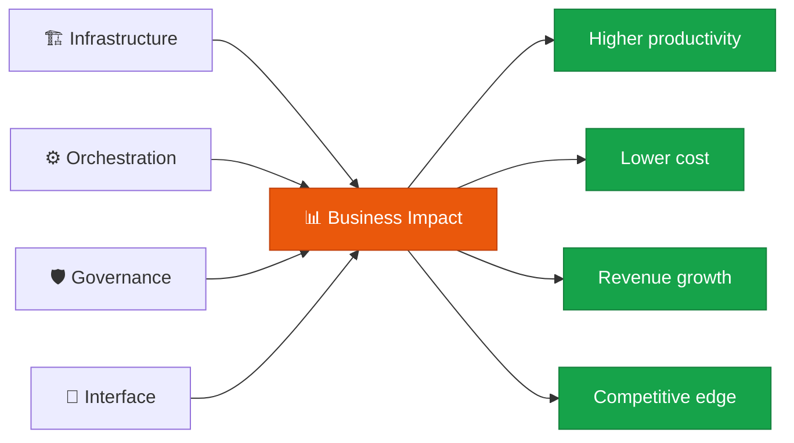

**Value & ROI** — quantitatively assessing whether AI adoption is actually converting into business value.

## Role of this domain

Business Impact is where the five-domain framework's **value is finally realized**. Every AI investment is ultimately justified — or not — in this domain.

## Core components

| Component | Description |
|---|---|
| **KPI & ROI analysis** | Measuring productivity gains, cost savings, and revenue contribution |
| **Time-to-market** | Speed of applying AI technology to real products and services |
| **Business model innovation** | New products, services, and market strategies enabled by AI |
| **Scale-up** | Spreading successful use cases across the whole organization |

## Core evaluation lens

Assess whether AI adoption goes beyond simple cost cutting to a **fundamental change in how work gets done**.

- **Efficiency**: doing existing work faster
- **Automation**: AI replacing existing work
- **Innovation**: creating new work that is only possible because of AI

## Health check questions

> "Is AI adoption creating new value, not just cutting costs?"

- [ ] Is ROI measured per AI project?
- [ ] Is time-to-market for new AI capabilities getting shorter?
- [ ] Are we exploring new business models that only AI makes possible?
- [ ] Are successful use cases spreading to other teams and departments?


  
  
  
  

