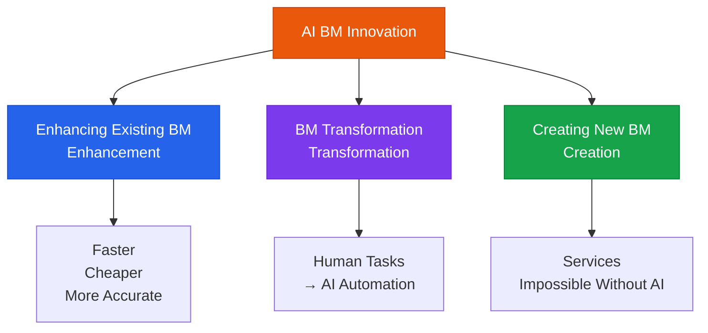

# Business Model (BM) Innovation

Developing new products and services through AI, and strategies for market entry

## Types of BM Innovation Enabled by AI



## Examples of AI BM Innovation

### Enhancing Existing BM (Enhancement)

| Industry | Existing BM | After AI Enhancement |
|---|---|---|
| **Legal** | Lawyers review contracts | AI does the first pass, lawyer gives final review (10x faster) |
| **Healthcare** | Doctors interpret imaging | AI-assisted diagnosis (higher accuracy, frees up doctor focus) |
| **Education** | Instructor teaches one-to-many | AI personal tutor + instructor-led group deep dives |

### Creating New BM (Creation)

**AI-First Services**:

```
Example: AI-based personalized learning platform
  - Before: Same curriculum for all students
  - With AI: Per-student weakness analysis → custom problem generation → real-time feedback
  - Result: 3x learning efficiency, 2x completion rate

Example: AI legal advisory subscription service
  - Before: Lawyer fees of hundreds of thousands of KRW per hour
  - With AI: 50K KRW/month subscription → 24-hour basic legal Q&A
  - Result: Dramatically improved legal access for small and medium businesses
```

## AI BM Innovation Evaluation Matrix

When evaluating a new AI BM idea:

| Evaluation Criteria | Question | Score (1-5) |
|---|---|---|
| **Market Size** | Is the target market large enough? | |
| **AI Differentiation** | Is this a service impossible without AI? | |
| **Technical Feasibility** | Can it be implemented with current technology? | |
| **Profitability** | Are the unit economics sustainable? | |
| **Barriers to Entry** | Is it hard for competitors to replicate? | |

## AI Business Model Canvas

Adding an AI perspective to the traditional Business Model Canvas:

```
[Additional AI BM Questions]

Value Proposition:   What new value does AI make possible?
Key Activities:       What activities does AI replace or enhance?
Cost Structure:       What AI-specific costs exist (LLM API, infrastructure, etc.)?
Revenue Streams:      Can AI features be monetized as an add-on?
Key Resources:         Do you have proprietary data or trained models?
```
