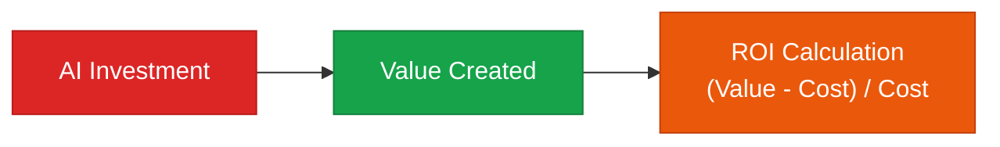

A metrics framework for quantitatively measuring the impact of AI adoption

## AI ROI Calculation Framework



**ROI = (Value Created by AI - Total AI Cost) / Total AI Cost × 100%**

## Types of Value Measurement

### Quantitative Measurement (Directly Measurable)

| Value Type | Measurement Metric | Example |
|---|---|---|
| **Time Savings** | Reduction rate in task processing time | Report writing: 4 hours to 30 minutes |
| **Cost Savings** | Reduction in labor and outsourcing costs | Monthly cost: 2M KRW to 500K KRW |
| **Error Reduction** | Error rate, rework frequency | Typo rate: 5% to 0.5% |
| **Throughput Increase** | Cases handled per person | 1 person: 50 to 200 cases/day |

### Qualitative Measurement (Indirect Effects)

| Value Type | Measurement Method |
|---|---|
| **Employee Satisfaction** | Quarterly survey |
| **Decision Quality** | Tracking outcomes 6 months after decisions |
| **Innovation Speed** | Time from new idea to execution |
| **Customer Satisfaction** | Change in NPS, CSAT |

## AI Project ROI Calculation Example

### Case: Customer Support AI Chatbot

```
[Costs]
  LLM API cost:            2M KRW / month
  Development & operations labor: 3M KRW / month
  Infrastructure cost:     500K KRW / month
  Total cost:              5.5M KRW / month

[Value]
  Reduction in agent case volume: 2,000 cases / month
  Agent labor cost savings:  16M KRW / month (2,000 cases × 8,000 KRW/case)
  24-hour service:          Customer satisfaction NPS +15 points
  Total value:               16M KRW+ / month

[ROI]
  Monthly net profit: 16M - 5.5M = 10.5M KRW
  ROI:     10.5M / 5.5M = 191%
  Payback period: approximately 1 month
```

## KPI Dashboard Structure

```
[Monthly AI Performance Dashboard]

📈 Productivity
  · Output per employee: +23% vs. previous month
  · Average task completion time: 4.2h → 1.8h

💰 Cost
  · Total AI investment cost: 8.5M KRW
  · Cost savings achieved: 21M KRW
  · Net ROI: 147%

🎯 Quality
  · Error rate: 3.2% → 0.8%
  · Customer satisfaction (CSAT): 78 → 86

⚡ Speed
  · New feature time-to-market: 6 weeks → 3 weeks
```
