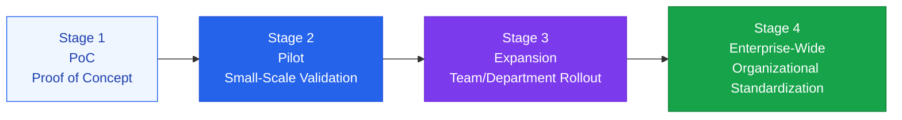

# Scale-Up Strategy

A systematic strategy for spreading successful AI use cases company-wide

## Stages of AI Scale-Up



## Key Activities at Each Stage

### Stage 1: PoC (1-4 weeks)
- Goal: "Is this technically feasible?"
- Team: 1-2 AI developers
- Success Criteria: Confirm technical feasibility
- Deliverables: Demo, technical review report

### Stage 2: Pilot (1-3 months)
- Goal: "Does this deliver value to real users?"
- Team: AI developers + domain experts + user group
- Success Criteria: Achieve measurable KPIs
- Deliverables: ROI analysis, user feedback, improvement items

### Stage 3: Expansion (3-6 months)
- Goal: "Can this be applied to other teams?"
- Team: AI team + business teams
- Success Criteria: Successful adoption by multiple teams
- Deliverables: Standardized playbook, internal training materials

### Stage 4: Enterprise-Wide Standardization (6-12 months)
- Goal: "Has this become part of how the organization works?"
- Team: AI CoE (Center of Excellence)
- Success Criteria: Routine use by all employees
- Deliverables: AI governance policy, sustained operating model

## Structuring an AI Center of Excellence (CoE)

An organizational structure for company-wide AI scale-up:

```
AI CoE
├── AI Strategy (Chief AI Officer)
│   └── AI roadmap, governance policy
├── AI Engineering
│   └── Shared infrastructure, MLOps, security
├── AI Products
│   └── Internal AI tools, platforms
└── AI Capability Building
    └── Training, community, AI champions
```

## Overcoming Resistance to Scale-Up

| Resistance Type | Root Cause | Response Strategy |
|---|---|---|
| **Distrust of the Technology** | "AI can be wrong" | Share real accuracy data, build trust incrementally |
| **Job Insecurity** | "AI will replace my job" | Educate that AI is a tool, support job transitions |
| **Resistance to Change** | "The old way works better" | Share success stories from early adopters |
| **Technical Barriers** | "It's too hard to use" | Improve UX, provide adequate training |
