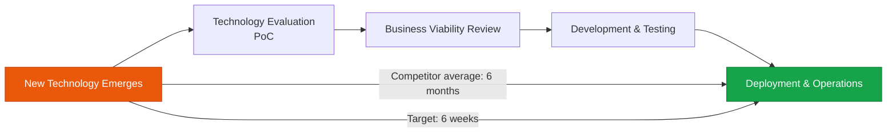

The speed at which new AI technology is applied to real services — a powerful competitive advantage in its own right

## Why Time-to-Market Matters

AI technology evolves rapidly. When a new model or technique emerges, the **speed at which it is applied** to a real service becomes a powerful business advantage in itself.



## Strategies for Shortening Time-to-Market

### 1. Build an AI Experimentation Platform

A standardized experimentation environment accelerates PoC speed:

```
AI Experimentation Platform Components:
  ✅ Model registry (catalog of available models)
  ✅ Prompt experimentation notebooks (Jupyter + LangSmith)
  ✅ Data connectors (standardized data access)
  ✅ Rapid deployment pipeline (CI/CD for AI)
  ✅ A/B testing framework
```

### 2. Modular AI Components

Package reusable AI components into libraries:

```
ai-components/
├── retrievers/       # Collection of RAG retrievers
├── evaluators/       # Collection of quality evaluators
├── guardrails/       # Collection of guardrails
├── formatters/       # Output format converters
└── connectors/       # External system connectors
```

### 3. "Fast Lane" Experimentation Process

An accelerated process for validating new technologies:

| Stage | Duration | Goal |
|---|---|---|
| **Technology Assessment** | 1 day | Understand core capabilities, estimate cost |
| **PoC Development** | 1 week | Confirm core functionality works |
| **Internal Testing** | 1 week | Validate quality, performance, and cost |
| **Pilot Deployment** | 2 weeks | Validate with a limited user group |
| **Full Deployment** | 2 weeks | Gradual rollout |

The goal is to complete new technology adoption within **6 weeks total**.

## Time-to-Market KPIs

| Metric | Measurement Method | Target |
|---|---|---|
| **Technology Awareness → PoC Complete** | Date difference | < 1 week |
| **PoC → Pilot Deployment** | Date difference | < 3 weeks |
| **Pilot → Full Deployment** | Date difference | < 4 weeks |
| **Overall T2M** | Awareness → Full Deployment | < 8 weeks |
