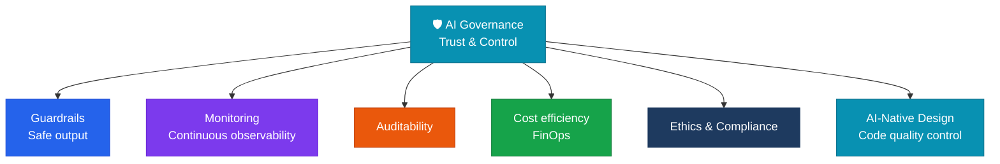

**Trust & Control** — keeping AI operating safely and consistently within the boundaries a company and society set for it.

## Role of this domain

Governance covers the trust side of the five-domain framework's **Foundation**. If infrastructure is the physical foundation, governance is the **logical and institutional foundation** of an AI system.

## Core components

| Component | Description |
|---|---|
| **Guardrails & security** | Blocking harmful content, preventing leaks of personal data and trade secrets |
| **Monitoring & observability** | Hallucination checks, latency, and cost tracking |
| **Auditability** | Traceable logging and after-the-fact verification of AI output |
| **FinOps** | Managing AI cost sustainability at the governance level |
| **Ethics & compliance** | AI ethics guidelines, responding to regulation such as the EU AI Act |
| **AI-Native design** | Controlling the quality of AI-generated code via ADRs, tech-debt tracking, and PR checklists |

## Beyond security: FinOps

Governance is not only about security. **Cost efficiency**(FinOps) has to be managed at the governance level to keep AI adoption sustainable.

## Health check questions

> "Can we verify after the fact why our AI system produced a given result?"

- [ ] Are all AI requests and responses logged?
- [ ] Is a hallucination-detection mechanism applied in production?
- [ ] Is monthly AI spend tracked and optimized against budget?
- [ ] Do we regularly review compliance with regulation such as the EU AI Act?
- [ ] Is AI-generated code written to meet ADR standards?


  
  
  
  
  
  

