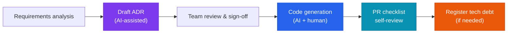

A set of design-document templates that helps AI coding teams collaborate efficiently while keeping control over the quality of AI-generated code. The goal is to capture AI's productivity gains without losing the system's consistency and maintainability.

## Document structure

```
project/
├── docs/
│   ├── decisions/          # ADR — why did we choose this approach?
│   ├── architecture/       # C4 Model — system structure and context
│   ├── standards/          # Implementation rules — coding standards and guardrails for AI to follow
│   └── debt/               # Tech-debt register — issues to resolve later
└── .github/
    └── PULL_REQUEST_TEMPLATE.md
```

| Document | Role |
|---|---|
| [ADR Template](adr-template) | Records architecture decisions — why a given technology was chosen |
| [Tech-Debt Register](debt-register) | Tracks AI-generated code that needs improvement |
| [PR Checklist](pr-checklist) | PR review guide that includes AI-development checks |

---

## Three principles for collaborating with AI

### 1. Provide context first

Before coding starts, have the AI read the relevant ADRs and architecture docs first.

```
"First read the latest ADRs in our project's docs/decisions,
then write the following code according to those rules."
```

### 2. Design, then implement

For any major feature, write the ADR first — or have the AI review a design draft — before generating code.



### 3. Record debt immediately

Any stopgap the AI suggests, or code that clearly needs refactoring, goes straight into `debt-register.md`. Don't try to remember it later — register it the moment you spot it.

---

## Wiring documents into different AI tools

| Tool | How to configure |
|---|---|
| **Claude Code** | Reference the `docs/decisions` path explicitly in `CLAUDE.md` |
| **Cursor** | Reference the `/docs` path in `.cursorrules` |
| **Windsurf** | Reference the `/docs` path in `.windsurfrules` |
| **GitHub Copilot** | Write guidelines in `.github/copilot-instructions.md` |

### CLAUDE.md example

```markdown
## Design principles
- Before writing code, check the latest ADRs in docs/decisions/.
- If a new decision is needed, draft it using the ADR template.
- If you write stopgap code, you must log it in docs/debt/debt-register.md.
```

---

## Rule: three or more "high"-impact debt items

> **Paying down tech debt takes priority** over new feature development.

Once the tech-debt register accumulates three or more "high"-impact items, debt repayment tasks get top priority in sprint planning.


  
  
  

