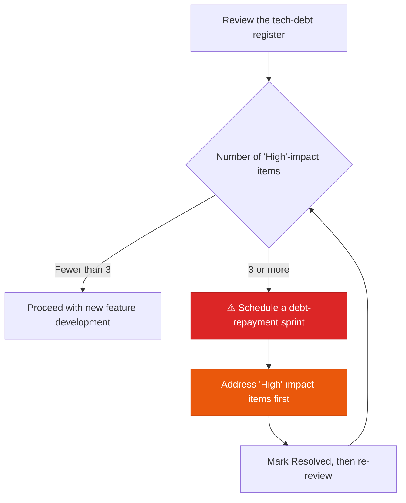

Systematically manage AI-generated code that "**works, but needs improvement**."

## Why tech-debt management matters more with AI coding

AI generates code that works quickly, but the following patterns show up often:

- Edge cases handled via hardcoding
- Implementation completed without tests
- The same problem solved differently from existing patterns (duplicate patterns)
- Inefficient queries that prioritize readability over performance

If you don't record these immediately, the debt piles up quickly and becomes hard to manage later.

---

## Register template

Copy the content below and save it as `docs/debt/debt-register.md`.

```markdown
# 🚩 Tech-Debt & Risk Register

Tracks AI-generated code that "works, but needs improvement."

| ID | Date Logged | Debt Item & Description | Impact | Repayment Plan | Status |
|:---|:---:|:---|:---:|:---|:---:|
| DB-001 | 05-03 | Hardcoded exception handling in the auth logic | Medium | Resolve during next sprint's refactoring | Open |
| DB-002 | 05-03 | Insufficient test coverage (AI-generated code) | High | Add tests within 3 days of feature release | In Progress |

> **Rule**: Once three or more items reach 'High' impact,
> prioritize debt repayment over new feature development.
```

---

## Field definitions

| Field | Description | Example |
|---|---|---|
| **ID** | Sequential number in `DB-NNN` format | DB-001 |
| **Date Logged** | MM-DD format | 05-06 |
| **Debt Item** | Which file/module, and what the problem is | N+1 query in `UserService.ts` |
| **Impact** | Low / Medium / High | High |
| **Repayment Plan** | When and how it will be resolved | Optimize the query within the next sprint |
| **Status** | Open / In Progress / Resolved | Open |

### Impact criteria

| Impact | Criteria |
|---|---|
| **High** | Affects security, performance, or data integrity, or blocks other feature development |
| **Medium** | Degrades code quality, may cause problems as the system scales |
| **Low** | Naming, comments, minor refactoring, and similar issues |

---

## AI prompt for surfacing debt

A prompt to have the AI self-assess during PR review:

```
Review the code you just wrote from the following angles,
and report the results in Tech-Debt Register (debt-register.md) format:

1. Are there any hardcoded values or stopgap workarounds?
2. Is any edge-case handling missing?
3. Is there logic with no tests, or with insufficient test coverage?
4. Are there any queries or logic likely to cause performance issues?
5. Is anything implemented differently from existing patterns?

List each item in DB-NNN format.
```

---

## Debt-repayment prioritization flow


