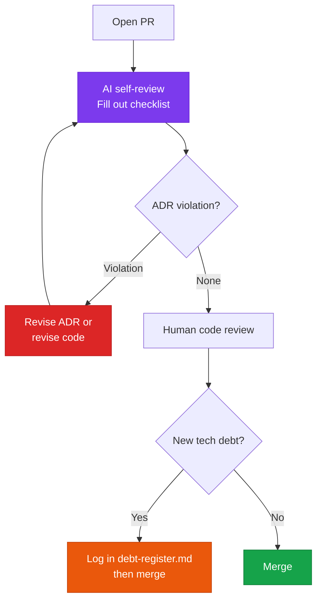

A pull-request review guide that includes AI-development checks.

## How to use

Save the template below as `.github/PULL_REQUEST_TEMPLATE.md`, and GitHub will load it automatically whenever a PR is created.

---

## Template

```markdown
## 📝 Summary of changes
- [ ] What feature did you implement or fix?
- [ ] Related issue/ticket number:

## 🤖 AI development checks
- [ ] Has a human verified the business logic in any AI-generated code?
- [ ] Did you provide the AI with the relevant ADRs and design docs as context?
- [ ] Have unnecessary AI comments or test-only code been removed?

## 🏗️ Design & quality checks
- [ ] Does this conflict with the existing architecture (C4 Model)?
- [ ] If a new decision was made, was an ADR written or updated?
- [ ] Was any newly introduced tech debt logged in `debt-register.md`?
- [ ] Are unit tests included, and do they pass?

## 📸 Screenshots (if applicable)
(Attach if there are UI changes)
```

---

## Checklist item walkthrough

### 🤖 AI development checks

"**Did a human verify the business logic in AI-generated code?**"

AI produces code that is syntactically correct and functional, but it can misinterpret business rules. Things like discount-rate calculations, permission checks, and data-validation rules must always be reviewed by a human.

"**Did you provide the AI with the relevant ADRs as context?**"

Generating code without ADRs can lead the AI to use patterns that diverge from the team's existing decisions. Confirm that relevant ADRs were provided as context before coding began.

"**Have unnecessary AI comments or test-only code been removed?**"

AI often leaves behind things like `// TODO: implement this`, `// This is a placeholder`, or stray `console.log` calls. Confirm none of these remain in production code.

### 🏗️ Design & quality checks

"**Was newly introduced tech debt logged?**"

Running the AI prompt below during PR review as a self-check helps prevent this from being missed.

```
Review the changed code in this PR and list any items that should be
logged as tech debt, in debt-register.md format.
Focus on intentional stopgap implementations, insufficient tests, and potential performance issues.
```

---

## PR review flow



---

## Having the AI self-assess against the PR checklist

Before opening a PR, ask the AI to self-assess directly against the checklist:

```
Self-assess the code you just wrote against the checklist items in
.github/PULL_REQUEST_TEMPLATE.md.

Rate each item [Pass / Fail / N/A], and for any Fail items,
suggest how to fix them.
```

This lets you catch issues before a reviewer does, and helps prevent tech debt from going unlogged.
