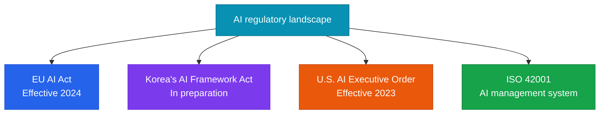

Applying AI ethics guidelines and responding to AI regulation in Korea and abroad.

## Current AI regulatory landscape



## EU AI Act risk classification

| Risk level | Examples | Requirements |
|---|---|---|
| **Prohibited** | Social credit scoring, real-time biometric identification | Banned outright |
| **High-risk** | AI for hiring, credit scoring, medical diagnosis | Strict regulation and auditing |
| **Limited-risk** | Chatbots, deepfakes | Transparency obligations |
| **Minimal risk** | Spam filters, AI in games | Self-regulation |

## Applying AI ethics principles

### Anthropic's Constitutional AI approach

An approach that internalizes ethical principles during model training:

```
Example principles:
- Do not provide information that is harmful or dangerous to people
- Do not generate discriminatory or biased responses
- State uncertainty explicitly when it exists
- Respect individual privacy
```

### Practical checklist

**Bias review**:
- [ ] Audit training data for demographic bias
- [ ] Test model output fairness across different groups
- [ ] Monitor for bias on a regular (quarterly) basis

**Ensuring transparency**:
- [ ] Disclose to users when content is AI-generated
- [ ] Provide explanations for AI decisions (explainability)
- [ ] Disclose data usage and personal-data handling practices

**Establishing accountability**:
- [ ] Clearly designate AI system owners and accountable parties
- [ ] Establish an incident-reporting procedure for AI-related issues
- [ ] Operate a regular ethics review committee
