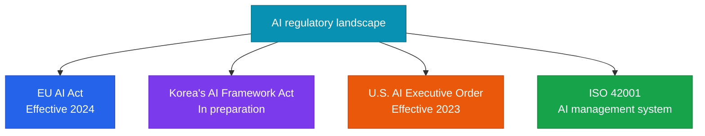

Applying AI ethics guidelines and responding to AI regulation in Korea and abroad.

## Current AI regulatory landscape


```mermaid
flowchart TD
    A["AI regulatory landscape"] --> B["EU AI Act<br/>Effective 2024"]
    A --> C["Korea's AI Framework Act<br/>In preparation"]
    A --> D["U.S. AI Executive Order<br/>Effective 2023"]
    A --> E["ISO 42001<br/>AI management system"]

    style A fill:#0891B2,stroke:#0E7490,color:#fff
    style B fill:#2563EB,stroke:#1D4ED8,color:#fff
    style C fill:#7C3AED,stroke:#6D28D9,color:#fff
    style D fill:#EA580C,stroke:#C2410C,color:#fff
    style E fill:#16A34A,stroke:#15803D,color:#fff
```

## EU AI Act risk classification

| Risk level | Examples | Requirements |
|---|---|---|
| **Prohibited** | Social credit scoring, real-time biometric identification | Banned outright |
| **High-risk** | AI for hiring, credit scoring, medical diagnosis | Strict regulation and auditing |
| **Limited-risk** | Chatbots, deepfakes | Transparency obligations |
| **Minimal risk** | Spam filters, AI in games | Self-regulation |

## Responsible AI Dimensions

Regulation says what is prohibited; it does not say how to build. The industry has converged on a set of dimensions that turn "responsible AI" into things that can actually be assigned, implemented, and audited. Every one of them is already a control somewhere in this framework — the value of the list is that it shows which of them you have left unattended:

| Dimension | The question it asks | Where the control lives |
|---|---|---|
| **Fairness & bias mitigation** | Does the system produce different outcomes for different groups? | Bias review checklist below; drift checks in [Monitoring & Observability](/docs/governance/monitoring/) |
| **Explainability** | Can we say why the system produced this output? | [AI Auditability](/docs/governance/auditability/) decision records; source citation in [RAG](/docs/orchestration/rag/) |
| **Privacy & security** | Can the system leak data, or be made to act against its operator? | [Guardrails & Security](/docs/governance/guardrails/) — PII detection and masking, prompt-injection defense |
| **Veracity & robustness** | Is the output actually true, and does it hold up under unusual input? | Hallucination detection in [Guardrails](/docs/governance/guardrails/); AA-Omniscience scoring in [AI Model Benchmarking](/docs/infrastructure/ai-model-benchmark/) |
| **Transparency** | Do people know they are dealing with AI, and on what terms? | Disclosure patterns in [AI UI/UX Design](/docs/interface/ux-design/); [AI Literacy Education](/docs/interface/ai-literacy/) |
| **Governance & accountability** | Who is answerable when it goes wrong, and how would we know? | The [Governance](/docs/governance/) domain as a whole; [AI-Native Design Framework](/docs/governance/ai-native/) for decision records |

Two notes on using this as a checklist. The dimensions are not independent — an unexplainable system cannot be audited for fairness, so explainability gates the dimension above it. And each one needs a named owner: a dimension that belongs to everybody is measured by nobody.

## Applying AI ethics principles

### Anthropic's Constitutional AI approach

An approach that internalizes ethical principles during model training:

```
Example principles:
- Do not provide information that is harmful or dangerous to people
- Do not generate discriminatory or biased responses
- State uncertainty explicitly when it exists
- Respect individual privacy
```

### Practical checklist

**Bias review**:
- [ ] Audit training data for demographic bias
- [ ] Test model output fairness across different groups
- [ ] Monitor for bias on a regular (quarterly) basis

**Ensuring transparency**:
- [ ] Disclose to users when content is AI-generated
- [ ] Provide explanations for AI decisions (explainability)
- [ ] Disclose data usage and personal-data handling practices

**Establishing accountability**:
- [ ] Clearly designate AI system owners and accountable parties
- [ ] Establish an incident-reporting procedure for AI-related issues
- [ ] Operate a regular ethics review committee
