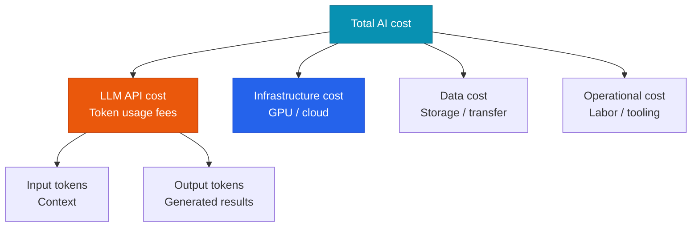

# AI FinOps

Managing AI costs at the governance level to keep AI operations sustainable.

## AI cost structure



## Cost-optimization levers

### 1. Model downgrading (highest impact)

| Model switch | Cost savings | Performance impact |
|---|---|---|
| Claude Opus → Sonnet | ~80% savings | Negligible for lower-complexity tasks |
| Claude Sonnet → Haiku | ~70% savings | Negligible for simple classification/summarization |
| GPT-4o → GPT-4o-mini | ~85% savings | Sufficient for most tasks |

### 2. Prompt caching

```python
# Example: Anthropic prompt caching
# Use caching when the system prompt repeats across calls
messages = [
    {
        "role": "user",
        "content": [
            {
                "type": "text",
                "text": long_system_context,
                "cache_control": {"type": "ephemeral"}  # Mark for caching
            },
            {"type": "text", "text": user_query}
        ]
    }
]
# A cache hit cuts input token cost by 90%
```

### 3. Batch processing

For workloads that don't need a real-time response, the Batch API cuts cost by 50%:

```python
# Anthropic Message Batches API
batch_request = {
    "requests": [
        {"custom_id": "task_1", "params": {...}},
        {"custom_id": "task_2", "params": {...}},
    ]
}
```

## FinOps dashboard KPIs

| KPI | Description | Target |
|---|---|---|
| **Cost per feature unit** | Cost per document summarized | Within budget |
| **Cache hit rate** | Prompt-caching efficiency | > 40% |
| **Token efficiency** | Token usage relative to output quality | Improving trend |
| **Monthly cost growth rate** | Month-over-month cost increase | At or below usage growth rate |
