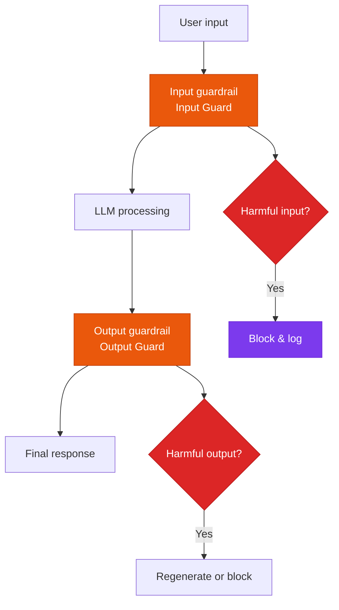

A multi-layered security strategy for blocking harmful content and preventing leaks of personal data and trade secrets.

## Multi-layered security architecture



## Input guardrails

### Prompt injection detection

```python
# Detect prompt injection attack patterns
injection_patterns = [
    r"ignore previous instructions",
    r"system prompt",
    r"you are now",
    r"jailbreak",
]

def detect_injection(user_input: str) -> bool:
    for pattern in injection_patterns:
        if re.search(pattern, user_input, re.IGNORECASE):
            return True
    return False
```

### PII detection & masking

```python
# Automatically detect and mask personal data
pii_patterns = {
    "email": r"[a-zA-Z0-9._%+-]+@[a-zA-Z0-9.-]+\.[a-zA-Z]{2,}",
    "phone": r"010[-\s]?\d{4}[-\s]?\d{4}",
    "resident_id": r"\d{6}[-]\d{7}",
}
```

## Output guardrails

### Hallucination detection

```python
# Check whether the output is grounded in the source documents
faithfulness_score = evaluate_faithfulness(
    response=llm_output,
    context=retrieved_documents
)
if faithfulness_score < 0.7:
    flag_for_review(llm_output)
```

### Content filtering categories

| Category | Handling |
|---|---|
| **Violent content** | Blocked immediately |
| **Sexual content** | Blocked immediately |
| **Hate speech** | Blocked immediately |
| **Contains personal data** | Masked, then allowed |
| **Trade secrets** | Allowed after review |
| **Medical/legal advice** | Disclaimer added |

## Recommended tools

- **Guardrails AI**: Python-based open-source guardrails framework
- **LlamaGuard**: Meta's LLM-based content-safety classifier
- **NeMo Guardrails**: NVIDIA's guardrails framework for conversational AI
- **AWS Bedrock Guardrails**: Managed, cloud-based guardrails
