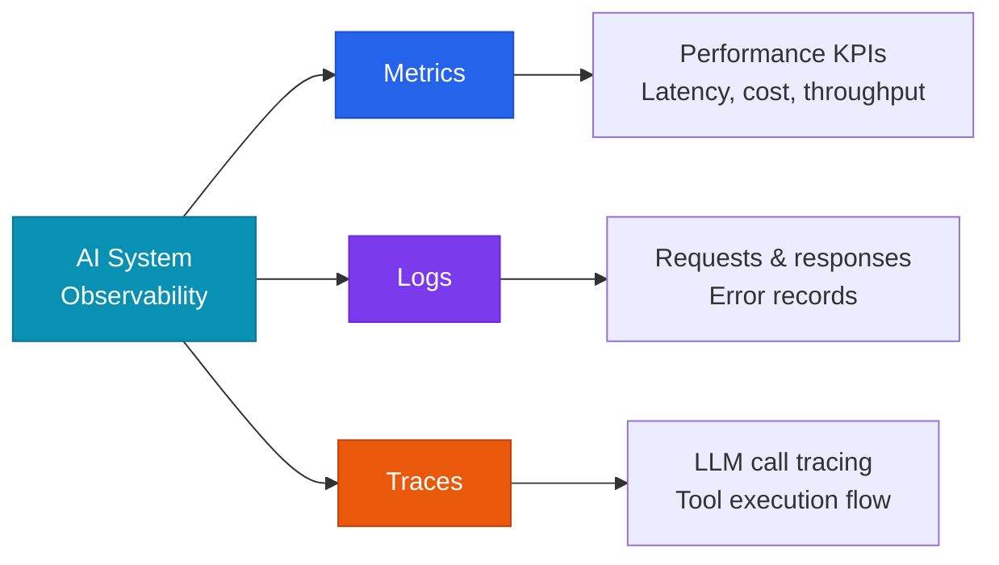

# Monitoring & Observability

An observability framework for tracking the quality, performance, and cost of AI systems in real time.

## The three pillars of observability



## Key monitoring metrics

### Quality metrics

| Metric | Description | Target |
|---|---|---|
| **Faithfulness** | Degree to which the output is grounded in context | > 0.85 |
| **Answer Relevancy** | Relevance of the answer to the question | > 0.85 |
| **Hallucination Rate** | Share of outputs that are factually incorrect | < 5% |

### Performance metrics

| Metric | Description | Target |
|---|---|---|
| **TTFT** | Time To First Token | < 1s |
| **TPS** | Tokens Per Second (generation speed) | > 30 TPS |
| **P95 Latency** | 95th-percentile response time | < 3s |

### Cost metrics

| Metric | Description |
|---|---|
| **Cost per request** | Average LLM cost per request |
| **Monthly token usage** | Token consumption trend by model |
| **Cache hit rate** | Prompt-caching efficiency |

## LLM monitoring tools

| Tool | Characteristics | Best suited for |
|---|---|---|
| **LangSmith** | Integrated with the LangChain ecosystem | LangChain-based apps |
| **Langfuse** | Open source, self-hosted | Cost-sensitive, security-conscious teams |
| **Arize Phoenix** | Model performance & drift detection | Teams with an MLOps stack |
| **Helicone** | Simple proxy-based approach | Fast adoption |

## Recommended alerting setup

```yaml
alerts:
  - name: high_hallucination_rate
    condition: hallucination_rate > 0.10
    severity: critical
    action: page_on_call

  - name: cost_spike
    condition: hourly_cost > budget_threshold * 1.5
    severity: warning
    action: slack_notification

  - name: latency_degradation
    condition: p95_latency > 5000ms
    severity: warning
    action: slack_notification
```
