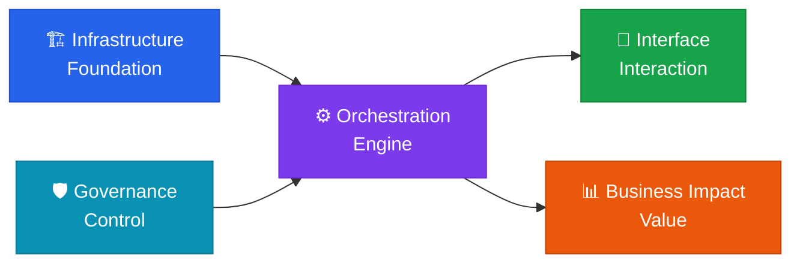

**Foundation & Build** — the physical and logical base that everything else in an AI system runs on.

## Role of this domain

Infrastructure & Architecture is the **Foundation** of the five-domain framework. No matter how good your prompting or orchestration strategy is, the whole system becomes unstable if the infrastructure underneath it is weak.

## Core components

| Component | Description |
|---|---|
| **Compute resources** | GPU/NPU servers, cloud infrastructure optimization |
| **Model selection & tuning** | Choosing the right LLM for the job, fine-tuning, quantization |
| **AI model benchmarking** | Quantitative analysis of intelligence, speed, and price based on Artificial Analysis |
| **Data pipelines** | Real-time data collection and cleaning for AI training and inference |
| **Vector DB** | Optimizing vector databases for semantic search |
| **MCP servers** | Context management based on the Model Context Protocol |

## Core strategy: the model mix

The goal is not simply to "own" models — it's to run a **model mix strategy** matched to specific purposes.

- **Large models**: complex reasoning, creative work
- **Small models**: fast responses, cost-efficient classification and summarization
- **Specialized models**: domain-specific tasks such as code generation, image understanding, and speech processing

## Health check questions

> "Does our infrastructure layer run a model-mix strategy that actually fits its purposes?"

- [ ] Is GPU/cloud spend optimized within budget?
- [ ] Does vector DB response time meet SLA in production?
- [ ] Have we chosen the right strategy among fine-tuning, prompt engineering, and RAG?
- [ ] Are MCP servers providing context reliably?


  
  
  
  
  
  
  

