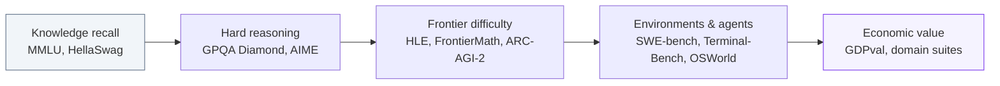
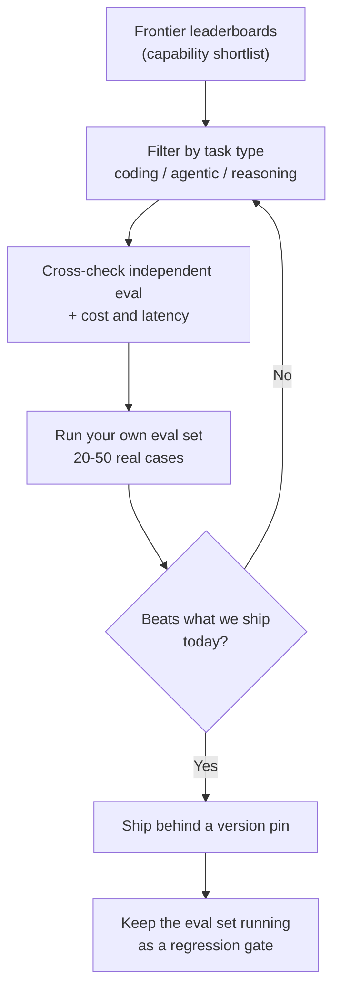

> Companion page to [AI Model Benchmarking](/docs/infrastructure/ai-model-benchmark/), which covers the composite indices used for **model and provider selection**. This page covers the **individual benchmarks** those indices are built from — what each one actually measures, how to read a leaderboard without being misled, and where evaluation is heading.

Public benchmarks and your own evaluations answer different questions, and confusing the two is the most common evaluation mistake:

| | Public benchmarks | Your own eval set |
| :--- | :--- | :--- |
| **Question answered** | Which models are worth trying at all? | Which model, prompt, and scaffold ship for *our* task? |
| **Data** | Shared, often public, sometimes in training corpora | Your inputs, your known-good outputs |
| **Decides** | The shortlist | The release |
| **Covered in** | This page | [Prompt & Context Design → Evaluation](/docs/orchestration/prompt-design/) |

A benchmark score is evidence about a model's general capability. It is never evidence that the model works for your workload.

---

## The Saturation Treadmill

Benchmarks have a life cycle. A new one separates frontier models cleanly; two years later, everyone scores in the high nineties and the differences at the top are noise. Each generation has been built to escape the ceiling of the last:

| Generation | Representative benchmarks | What broke it |
| :--- | :--- | :--- |
| **Knowledge recall** | **MMLU**, **HellaSwag**, **HumanEval** | Saturated above ~90%, and widely enough reproduced online to be assumed contaminated |
| **Hard reasoning** | **GPQA Diamond**, **AIME**, **MATH** | Frontier models now score at or above domain-expert level; the remaining gap is annotation error |
| **Frontier difficulty** | **Humanity's Last Exam**, **FrontierMath**, **ARC-AGI-2** | Deliberately built to be unsolved at release; several have moved fast anyway |
| **Environments & agents** | **SWE-bench Verified / Pro**, **Terminal-Bench**, **OSWorld**, **τ-bench** | Still the active frontier — success depends on the harness as much as the model |
| **Economic value** | **GDPval**, occupation- and industry-specific suites | Grading is expert judgement, so throughput and cost limit how fast they can grow |

A saturated benchmark is not worthless — it becomes a **regression smoke test**. A model that drops on MMLU has broken something. It just no longer ranks the top of the field.

---

## ARC-AGI — the fluid-intelligence line of benchmarks

Most benchmarks test what a model **knows**. [ARC-AGI](https://arcprize.org/) tests whether it can acquire a **new skill on the spot**: every task is a handful of input/output grid pairs illustrating a rule the model has never seen, and it must infer the rule and apply it to a held-out grid. Because each puzzle is novel by construction, memorizing the training set does not transfer — which is exactly why it stayed unsolved long after knowledge benchmarks fell.

| Version | Released | Shape of the task | Design intent |
| :--- | :--- | :--- | :--- |
| **ARC-AGI-1** | 2019 | Static grid puzzles | The original fluid-intelligence test; resisted scaling for five years, then fell to reasoning models |
| **ARC-AGI-2** | 2025 | Static grids, harder rule composition | Calibrated so that every task is solvable by at least two humans in two attempts, while frontier models started near zero |
| **ARC-AGI-3** | 2026 | Interactive game environments | Moves from one-shot answers to **exploration**: the agent must discover the rules of an unfamiliar environment by acting in it, over many turns |

Two things make ARC-AGI worth watching beyond the headline score:

- **Cost per task is reported alongside accuracy.** A system that brute-forces a puzzle with thousands of sampled programs is not doing the same thing as one that solves it in a single pass, and the leaderboard makes that visible instead of hiding it. This is the clearest mainstream example of **efficiency-normalized evaluation**.
- **A human baseline is measured, not assumed.** Tasks are validated on real people, so "AI vs. human" comparisons on ARC are grounded rather than rhetorical.

ARC-AGI-2 has since followed its predecessor up the curve — the snapshot below puts the top of that leaderboard above the benchmark's own grand-prize threshold, roughly eighteen months after release. ARC-AGI-3 is the more informative track today. It is the shift the whole field is making in miniature: from *answer this question* to *operate in this environment and figure out what the goal even is*.

---

## Benchmark map by capability

When a model is announced, the scores quoted are chosen by the vendor. This is the fuller map to check against:

| Capability | Benchmarks in use | Notes |
| :--- | :--- | :--- |
| **Knowledge & reasoning** | **GPQA Diamond**, **Humanity's Last Exam**, **MMLU-Pro** | HLE spans 100+ subjects with expert-written questions; a large fraction is multimodal |
| **Math** | **FrontierMath**, **AIME**, **MathArena** | FrontierMath is held privately and tiered by difficulty; MathArena scores competitions *after* the model's cutoff to avoid contamination |
| **Abstraction** | **ARC-AGI-2 / -3** | Novel-task reasoning rather than recall — see above |
| **Coding** | **SWE-bench Verified**, **SWE-bench Pro**, **LiveCodeBench**, **SciCode** | Verified is the human-filtered subset of SWE-bench; LiveCodeBench rotates in fresh problems continuously |
| **Terminal & tools** | **Terminal-Bench**, **τ-bench** | Deterministic grading via exit codes, file diffs, and output matching |
| **Computer use** | **OSWorld**, **WebArena** | The agent drives a real desktop or browser from screenshots; scores here remain far below human |
| **Long context** | **AA-LCR**, needle-and-reasoning variants | Retrieval over long inputs is largely solved; *reasoning* across the whole input is not |
| **Hallucination** | **AA-Omniscience**, **SimpleQA** | Score both what the model gets right and what it asserts wrongly — see [Guardrails & Security](/docs/governance/guardrails/) |
| **Economic value** | **GDPval** | 1,300+ tasks drawn from the real deliverables of 44 occupations across nine industries, graded by professionals against expert-produced work |

---

## Snapshot — where the numbers stood in September 2026

Scores below were compiled on **2026-09-06** from the public leaderboards linked in each row. They are included to show the *shape* of the field, not as a citable ranking: frontier numbers move weekly, aggregators disagree, and the entry at the top of any row will likely be stale by the time you read it. Follow the link before quoting a figure.

| Benchmark | Leading result | Runners-up | As of / source |
| :--- | :--- | :--- | :--- |
| **ARC-AGI-2** | GPT-6 Astra — **95.0%** | GPT-5.6 Sol 92.5%, Claude Opus 5 90.4% | Sep 3, 2026 — [BenchLM](https://benchlm.ai/benchmarks/arc-agi-2), [llm-stats](https://llm-stats.com/benchmarks/arc-agi-v2) |
| **ARC-AGI-3** | GPT-6 Astra — **62.7%** | Claude Opus 5 30.2%, GPT-5.6 Sol 7.8% | Sep 4, 2026 — [BenchLM](https://benchlm.ai/benchmarks/arcagi3), [ARC Prize](https://arcprize.org/leaderboard) |
| **Humanity's Last Exam** | Claude Fable 5.1 — **65%** (tool-assisted boards) down to **46.5%** (no tools, text only) | Claude Opus 5 64.7%, Claude Mythos 5 64.5% | Sep 4–5, 2026 — [BenchLM](https://benchlm.ai/benchmarks/hle), [Artificial Analysis](https://artificialanalysis.ai/evaluations/humanitys-last-exam), [llmrun](https://llmrun.dev/benchmark/hle) |
| **FrontierMath v2 (Tier 4)** | GPT-6 Astra — **97.6%** | GPT-5.6 Sol 83.0%, GPT-5.6 Terra 68.3% | Sep 4, 2026 — [BenchLM](https://benchlm.ai/benchmarks/frontiermathv2tier4), [Epoch AI](https://epoch.ai/benchmarks/frontiermath-tier-4-v2) |
| **SWE-bench Verified** | Claude Opus 5 — **96%** | Claude Mythos 5 95.5%, Claude Fable 5 95% | Sep 2–4, 2026 — [BenchLM](https://benchlm.ai/benchmarks/swe-bench-verified), [llm-stats](https://llm-stats.com/benchmarks/swe-bench-verified) |
| **SWE-bench Pro** | Claude Fable 5.1 — **81.2%** | — | 2026 — [CodingFleet](https://codingfleet.com/blog/swe-bench-pro-leaderboard-2026/) |
| **Terminal-Bench 2.0** | GPT-5.6 Sol — **91.9%** | Claude Mythos 5 88.0%, GPT-5.6 Terra 87.4% | Sep 2026 — [BenchLM](https://benchlm.ai/benchmarks/terminal-bench-2), [tbench.ai](https://www.tbench.ai/leaderboard/terminal-bench/2.0) |
| **OSWorld-Verified** | Qwen3.8 Max — **86.1%** | Claude Fable 5 85%, Claude Mythos 5 85% | Sep 4, 2026 — [BenchLM](https://benchlm.ai/benchmarks/osworld-verified), [Steel.dev](https://leaderboard.steel.dev/leaderboards/osworld/) |
| **GDPval** | GPT-5.2 — **70.9%** win+tie vs. expert deliverables (49.7% outright wins) | GDPval-AA Elo: Claude Opus 5 1862, Claude Fable 5.1 1853 | 2026 — [Epoch AI](https://epoch.ai/benchmarks/gdpval), [Artificial Analysis](https://artificialanalysis.ai/evaluations/gdpval-aa) |

Four things this table shows better than any argument:

- **The treadmill is fast.** ARC-AGI-2 was built in 2025 to be near-zero for models and is now above its own 85% grand-prize threshold, against an average individual human score of 66%. FrontierMath Tier 4 — the hardest tier of a benchmark designed to last — reads the same way at the top.
- **Protocol matters more than model at the top.** Humanity's Last Exam spans roughly 46% to 65% *for the same model family*, depending on whether search, browsing, and code execution are allowed. A number without its protocol is not a result.
- **Aggregators disagree.** SWE-bench Verified appears as 96% or 97% depending on whose harness ran it, and the top several models sit within about one point — inside the noise of the harness itself.
- **The unsaturated benchmarks are the interactive ones.** ARC-AGI-3, computer use, and long-horizon terminal work still have real headroom, and the gap between first and second place there is enormous compared to the coding leaderboards.

---

## Reading a leaderboard without being fooled

| Trap | What it looks like | What to do |
| :--- | :--- | :--- |
| **Contamination** | A model scores far better on a public benchmark than on its private variant | Prefer rotating or post-cutoff benchmarks (**LiveCodeBench**, **MathArena**, current-year **AIME**) |
| **Harness variance** | The same model posts very different agentic scores in different reports | Check the scaffold: tool set, retry budget, context length. On agentic benchmarks the harness is part of the result |
| **pass@k inflation** | An impressive number that turns out to be best-of-many attempts | Compare `pass@1` to `pass@1`, and check how many attempts each cell averages |
| **Overlapping confidence intervals** | Ranks 1–3 separated by a few points | On preference arenas, differences smaller than the CI are noise, not ranking |
| **Self-reported scores** | Vendor-run evaluation with an unspecified setup | Cross-check against an independent evaluator such as [Artificial Analysis](https://artificialanalysis.ai/) |
| **Cost blindness** | A top score achieved with enormous per-task compute | Read accuracy together with cost and latency, the way ARC-AGI reports it |
| **Private benchmarks** | Held-out sets that cannot be independently reproduced | They resist contamination but require trusting the maintainer — treat them as one signal, not the signal |

The practical rule is **triangulation**: a static academic benchmark, a human-preference arena, and an agentic suite. Where all three agree, the ranking is probably real. Where they disagree, the disagreement is usually the interesting information.

---

## Where evaluation is heading

| Trend | What is changing | Why it matters for infrastructure |
| :--- | :--- | :--- |
| **From questions to environments** | Benchmarks ship as runnable environments — a repo, a shell, a desktop, a customer-service simulator — rather than a list of prompts | Evaluation now needs sandboxes, container orchestration, and per-run isolation; running an agentic suite is an infrastructure project, not a script |
| **From accuracy to efficiency** | Cost, tokens, and wall-clock time are reported next to the score | Matches how models are actually chosen in production, where a 2-point gain rarely justifies a 10× cost |
| **From single-turn to long-horizon** | Tasks measured in hours of agent work, with partial credit and checkpoints | Reliability compounds: a 95%-per-step agent finishes a 50-step task less than one time in ten |
| **From static to live** | Continuously refreshed problem sets and post-cutoff competitions | Contamination resistance becomes a property of the benchmark's operating model, not its content |
| **From capability to value** | **GDPval**-style evaluation against real professional deliverables | Connects model choice to [business impact](/docs/business/) rather than to a score with no unit |
| **Goodhart pressure** | Benchmarks with verifiable rewards are also excellent RL training targets | A benchmark used for training stops measuring generalization; held-out and rotating sets are the only defense |

---

## Applying this in practice

### Checklist

- [ ] Identify which two or three benchmarks actually correspond to your workload — ignore the rest of the announcement
- [ ] Confirm the score is `pass@1` under a harness comparable to the one you will run
- [ ] Check the same model on an independent evaluator, not only the vendor's own numbers
- [ ] Read cost and latency alongside accuracy before shortlisting
- [ ] Verify against a contamination-resistant benchmark if the task resembles a well-known public dataset
- [ ] Replace the leaderboard with your own eval set before the release decision
- [ ] Re-run that eval set on every model and prompt version change — see [Prompt & Context Design](/docs/orchestration/prompt-design/)

---

## Related Categories

- [📊 AI Model Benchmarking](/docs/infrastructure/ai-model-benchmark/) — composite indices, provider comparison, openness
- [⚙️ Model Selection & Tuning](/docs/infrastructure/model-selection/) — turning a shortlist into a deployed model
- [🛡 AI Governance Overview](/docs/governance/) — hallucination monitoring and regulatory evidence
