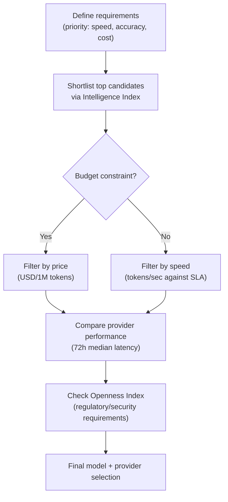

> Source: [Artificial Analysis](https://artificialanalysis.ai/) — an independent platform for analyzing AI model performance, price, and speed

One of the most important decisions when designing AI infrastructure is choosing **which model** to use and **through which API provider**. Artificial Analysis independently evaluates 483+ models to provide objective metrics.

---

## Three Core Evaluation Metrics

Every model is compared simultaneously along the following three axes.

| Metric | Description | Unit |
|---|---|---|
| **Intelligence** | Composite benchmark score across reasoning, knowledge, coding, math, etc. | 0–100 points |
| **Speed** | Output speed measured against real-time API calls | Tokens/sec |
| **Price** | Combined cost of input + output tokens | USD / 1M tokens |

> **Usage tip**: Looking at all three metrics together lets you identify the "best value" model. A model with high intelligence and low price isn't always the best choice — speed affects your SLA.

---

## Intelligence Index v4.0 — Detailed Benchmarks

The **Artificial Analysis Intelligence Index** is a weighted average across 10 independent tasks.

| Benchmark | Measured area |
|---|---|
| **GDPval-AA** | Ability to perform real economic-value tasks via web/shell access |
| **Terminal-Bench Hard** | Command execution and automation in terminal environments |
| **SciCode** | Scientific research code generation |
| **AA-LCR** | Long Context Reasoning |
| **AA-Omniscience** | Knowledge accuracy + hallucination detection |

### AA-Omniscience — Hallucination Detection Metric

- Score range: **–100 to +100**
- Positive for accurate information, negative when hallucination occurs
- Used from a **governance** perspective to identify models with low hallucination risk

---

## API Provider Performance Comparison

Even for the same model (e.g., GPT-4o), speed and price vary depending on **which API provider** you go through.

```
Major providers tracked by Artificial Analysis
─────────────────────────────────────
Amazon Bedrock  │ Google Vertex  │ Groq
Together.ai     │ Fireworks      │ Azure OpenAI
Replicate       │ Perplexity     │ ... (23 total)
```

### Provider Selection Criteria

- **Latency**: based on the 72-hour median — confirms stability excluding spikes
- **Output speed**: real-time tokens/sec measurement
- **Price**: separate input/output token costs, including whether caching discounts apply

---

## Multimedia AI Model Evaluation

Modalities beyond text are also evaluated via ELO-based blind preference voting.

| Category | Key models |
|---|---|
| **Text → Image** | Midjourney, DALL-E 3, Stable Diffusion, Flux |
| **Image editing** | Adobe Firefly, GPT-4o Vision, etc. |
| **Text → Video** | Sora, Runway Gen-3, Kling |
| **Text → Speech**(TTS) | ElevenLabs, OpenAI TTS, Google TTS |

---

## Openness Index — Model Openness Evaluation

A transparency metric to reference when choosing between proprietary and open-source models.

| Item | Description |
|---|---|
| **Availability** | Whether weights are open and local execution is possible |
| **Methodology transparency** | Level of disclosure of training methods and evaluation approach |
| **Training data** | Whether dataset sources and licenses are disclosed |

> **Governance link**: As regulatory compliance requirements (e.g., the AI Act) increasingly demand model transparency, the Openness Index can serve as supporting evidence for regulatory response.

---

## How to Use This in Infrastructure Design



### Decision Checklist

- [ ] Identify the task type — coding, reasoning, or multimodal?
- [ ] Check the relevant sub-benchmark scores in the Intelligence Index
- [ ] Compare speed and price across API providers offering the same model
- [ ] Verify acceptable hallucination levels using the AA-Omniscience score
- [ ] Confirm alignment with internal security policy and regulatory compliance via the Openness Index
- [ ] Validate stability using the 72-hour performance trend

---

## Related Categories

- [🛡 AI Governance Overview](../governance) — hallucination monitoring, regulatory compliance
- [📊 AI Business Impact](../business) — ROI analysis based on model cost
