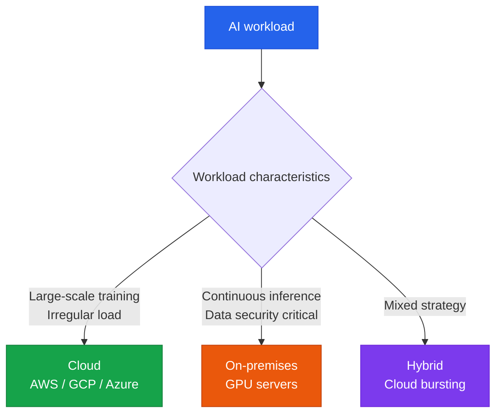

# Compute Resource Management

Strategies for cost-efficient operation of GPU/NPU servers and cloud infrastructure

## On-Premises vs. Cloud



## Cloud AI Service Comparison

| Item | AWS Bedrock | Google Vertex AI | Azure AI |
|---|---|---|---|
| **Key models** | Claude, Llama, Titan | Gemini, PaLM | GPT-4, Phi |
| **Fine-tuning** | Supported | Supported | Supported |
| **On-demand pricing** | Per-token billing | Per-token billing | Per-token billing |
| **Provisioned throughput** | Supported | Supported | Supported |

## Cost Optimization Strategies

### 1. Model Tiering

```
Complex tasks   → Large models (Claude Opus, GPT-4o)
General tasks   → Mid-size models (Claude Sonnet, GPT-4o-mini)
Simple tasks    → Small models (Claude Haiku, GPT-3.5)
```

### 2. Caching Strategy

For prompts or context that are reused repeatedly, **prompt caching** can cut costs by up to 90%.

### 3. Batch Processing

For workloads that don't require a real-time response, using the **Batch API** cuts costs by 50%.

## GPU Spec Guide

| Use case | Recommended GPU | Notes |
|---|---|---|
| **Large-scale training** | H100, A100 | 80GB+ VRAM |
| **Mid-size fine-tuning** | A10G, L40S | 24–48GB VRAM |
| **Inference server** | T4, L4 | 16GB VRAM, cost-efficient |
| **Local development** | RTX 4090 | 24GB VRAM |
