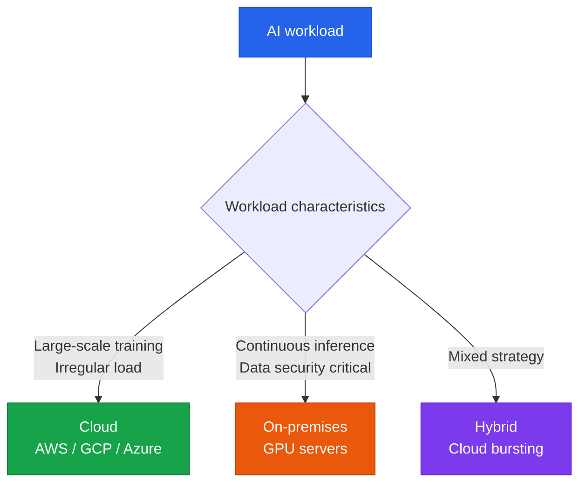

Strategies for cost-efficient operation of GPU/NPU servers and cloud infrastructure

## On-Premises vs. Cloud


```mermaid
flowchart TD
    A["AI workload"] --> B{"Workload characteristics"}
    B -->|"Large-scale training<br/>Irregular load"| C["Cloud<br/>AWS / GCP / Azure"]
    B -->|"Continuous inference<br/>Data security critical"| D["On-premises<br/>GPU servers"]
    B -->|"Mixed strategy"| E["Hybrid<br/>Cloud bursting"]

    style A fill:#2563EB,stroke:#1D4ED8,color:#fff
    style C fill:#16A34A,stroke:#15803D,color:#fff
    style D fill:#EA580C,stroke:#C2410C,color:#fff
    style E fill:#7C3AED,stroke:#6D28D9,color:#fff
```

## Cloud AI Service Comparison

| Item | AWS Bedrock | Google Vertex AI | Azure AI |
|---|---|---|---|
| **Key models** | Claude, Llama, Titan | Gemini, PaLM | GPT-4, Phi |
| **Fine-tuning** | Supported | Supported | Supported |
| **On-demand pricing** | Per-token billing | Per-token billing | Per-token billing |
| **Provisioned throughput** | Supported | Supported | Supported |

## Cost Optimization Strategies

### 1. Model Tiering

```
Complex tasks   → Large models (Claude Opus, GPT-4o)
General tasks   → Mid-size models (Claude Sonnet, GPT-4o-mini)
Simple tasks    → Small models (Claude Haiku, GPT-3.5)
```

### 2. Caching Strategy

For prompts or context that are reused repeatedly, **prompt caching** can cut costs by up to 90%.

### 3. Batch Processing

For workloads that don't require a real-time response, using the **Batch API** cuts costs by 50%.

## GPU Spec Guide

| Use case | Recommended GPU | Notes |
|---|---|---|
| **Large-scale training** | H100, A100 | 80GB+ VRAM |
| **Mid-size fine-tuning** | A10G, L40S | 24–48GB VRAM |
| **Inference server** | T4, L4 | 16GB VRAM, cost-efficient |
| **Local development** | RTX 4090 | 24GB VRAM |

## Managed Platforms vs. Self-Hosting

Before sizing a GPU, decide whether you should be holding one at all. There are three tiers, and they differ in what you own rather than in what the model can do:

| Tier | You own | Provider owns | Billing |
|---|---|---|---|
| **Managed model API** | Prompts, retrieval, application code | Models, capacity, scaling, patching | Per token, or provisioned throughput |
| **Managed ML platform** | Data, training code, model artifacts, endpoint config | Notebooks, training fleet, endpoint infrastructure | Per instance-hour, training and inference billed separately |
| **Self-hosted serving** | Everything, down to the CUDA version | Nothing | The GPUs, whether or not traffic arrives |

The two AWS entries in the comparison above sit in different tiers, and conflating them is a common planning mistake:

- **Amazon Bedrock** is the managed model API tier — a single interface over foundation models from several providers, with no infrastructure to run. Its adjacent features are the ones you would otherwise assemble yourself: managed knowledge bases for [RAG](/docs/orchestration/rag/), agent orchestration, and [Bedrock Guardrails](/docs/governance/guardrails/) for input and output filtering. Google Vertex AI and Azure AI occupy the same tier.
- **Amazon SageMaker** is the managed ML platform tier — an end-to-end environment for building, training, and deploying models you own, including classical ML on tabular data, not only foundation models. You choose the instance types and the endpoint stays up until you take it down.

A useful default: start on the managed API tier, because it turns a capacity problem into a line item. Move to a platform or to self-hosting only when a concrete requirement forces it — data residency, a model no provider hosts, a fine-tune you must own, or a sustained load where per-token pricing has become more expensive than the hardware.

## Serving Open Models

Self-hosting a model means running an inference server, and the serving engine decides how much of the GPU you actually get to use. On identical hardware, throughput differs by an order of magnitude between a naive request loop and a batching engine.

| Engine | Best fit |
|---|---|
| **vLLM** | High-throughput production serving — PagedAttention plus continuous batching |
| **TensorRT-LLM** | Lowest latency on NVIDIA hardware, at the cost of a compile step per model |
| **TGI** (Text Generation Inference) | Production serving inside a Hugging Face-centric stack |
| **Ollama / llama.cpp** | Local development, CPU and consumer-GPU inference |

The levers that decide throughput:

- **Continuous batching** — arriving requests join the running batch instead of waiting for it to drain
- **KV cache management** — paged attention lets many concurrent sequences share VRAM without pre-reserving worst-case space
- **Tensor parallelism** — split a model across GPUs once the weights exceed one card
- **Quantization** — buys VRAM headroom, and therefore concurrency, in exchange for some quality; see [Model Selection & Tuning](/docs/infrastructure/model-selection/)

What to hold a serving deployment to:

| Metric | What it tells you |
|---|---|
| **TTFT** (time to first token) | Perceived responsiveness — driven by prompt length and queue depth |
| **Inter-token latency** | How smooth the stream feels once generation starts |
| **Throughput** (aggregate tokens/sec) | What the GPU is actually returning for its cost |
| **Concurrency at target latency** | The number that sizes the fleet — peak throughput at an unacceptable TTFT is not capacity |
