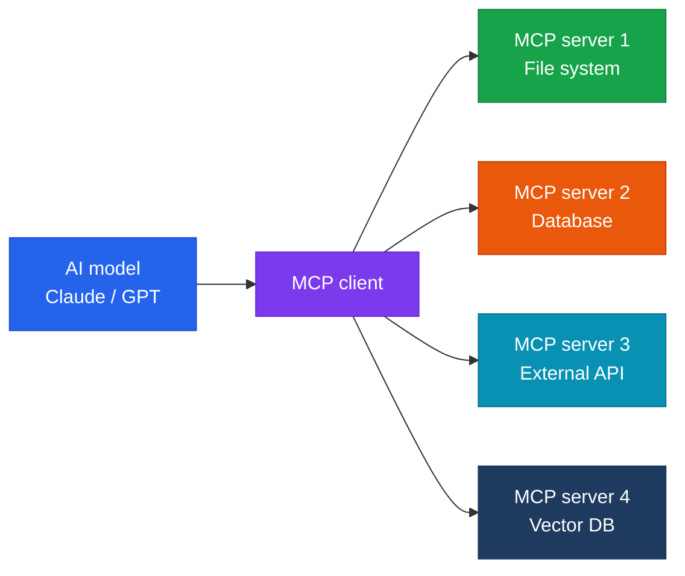

Model Context Protocol — a standard protocol for connecting AI models to external context and tools

## What Is MCP?

The **Model Context Protocol**(MCP) is an open standard released by Anthropic in 2024 that lets AI models safely interact with external data sources, tools, and services.



## Core Components of MCP

| Component | Role |
|---|---|
| **Resources** | Exposes data such as files, DB records, and API responses |
| **Tools** | Defines functions/actions the AI can invoke |
| **Prompts** | Reusable prompt templates |
| **Sampling** | Lets the server request inference from the AI |

## MCP Server Configuration Example

```json
{
  "mcpServers": {
    "filesystem": {
      "command": "npx",
      "args": ["-y", "@modelcontextprotocol/server-filesystem", "/path/to/docs"]
    },
    "database": {
      "command": "npx",
      "args": ["-y", "@modelcontextprotocol/server-postgres"],
      "env": {
        "DATABASE_URL": "postgresql://..."
      }
    }
  }
}
```

## MCP Management Considerations from an Infrastructure Perspective

- **Security**: restrict the resources an MCP server can access using the principle of least privilege
- **Availability**: assess the impact on AI workflows if an MCP server goes down
- **Performance**: monitor how tool-call latency affects overall response time
- **Version management**: maintain backward compatibility when an MCP server's schema changes
