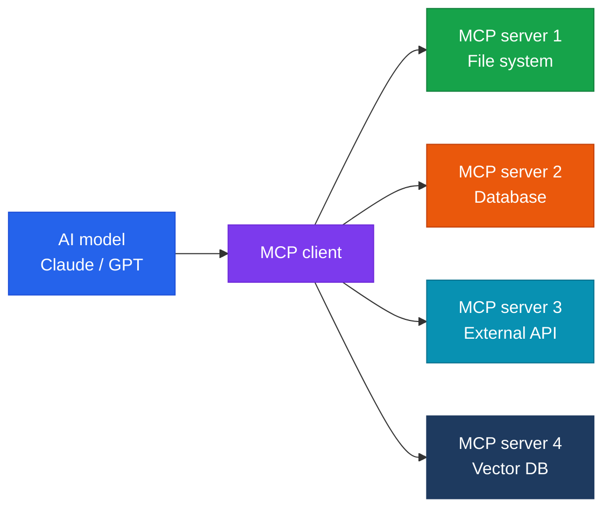
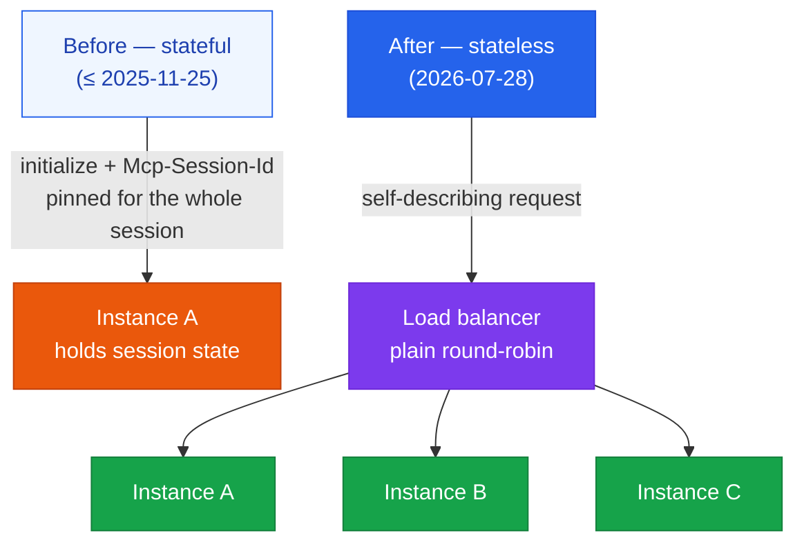

Model Context Protocol — a standard protocol for connecting AI models to external context and tools

## What Is MCP?

The **Model Context Protocol**(MCP) is an open standard released by Anthropic in 2024 that lets AI models safely interact with external data sources, tools, and services.

The current revision is **`2026-07-28`** — often called MCP 2.0 or v2, though the specification itself is versioned by date rather than by a major number. It is the largest restructuring since the protocol shipped: MCP stopped being a stateful, bidirectional session protocol and became a stateless request/response one. If you are running MCP servers as infrastructure, that change is the whole story, and it is covered in [The 2026-07-28 Revision](#the-2026-07-28-revision-stateless-mcp) below.


```mermaid
flowchart LR
    A["AI model<br/>Claude / GPT"] --> B["MCP client"]
    B --> C["MCP server 1<br/>File system"]
    B --> D["MCP server 2<br/>Database"]
    B --> E["MCP server 3<br/>External API"]
    B --> F["MCP server 4<br/>Vector DB"]

    style A fill:#2563EB,stroke:#1D4ED8,color:#fff
    style B fill:#7C3AED,stroke:#6D28D9,color:#fff
    style C fill:#16A34A,stroke:#15803D,color:#fff
    style D fill:#EA580C,stroke:#C2410C,color:#fff
    style E fill:#0891B2,stroke:#0E7490,color:#fff
    style F fill:#1E3A5F,stroke:#1E3A5F,color:#fff
```

## Core Components of MCP

| Component | Role | Status in `2026-07-28` |
|---|---|---|
| **Resources** | Exposes data such as files, DB records, and API responses | Active |
| **Tools** | Defines functions/actions the AI can invoke | Active |
| **Prompts** | Reusable prompt templates | Active |
| **Sampling** | Lets the server request inference from the AI | Deprecated — integrate with the LLM provider API directly |

## The 2026-07-28 Revision: Stateless MCP

Before this revision, a client opened a session with an `initialize`/`notifications/initialized` handshake, and every subsequent request carried an `Mcp-Session-Id` header that pinned it to the server instance holding that session. That made MCP servers stateful services: sticky sessions, session stores, and connection draining on deploy.

The revision removes sessions entirely. Every request is self-describing, so any instance can serve any request.


```mermaid
flowchart TD
    A1["Before — stateful<br/>(≤ 2025-11-25)"] -->|"initialize + Mcp-Session-Id<br/>pinned for the whole session"| B1["Instance A<br/>holds session state"]
    A2["After — stateless<br/>(2026-07-28)"] -->|"self-describing request"| LB["Load balancer<br/>plain round-robin"]
    LB --> C1["Instance A"]
    LB --> C2["Instance B"]
    LB --> C3["Instance C"]

    style A1 fill:#EFF6FF,stroke:#2563EB,color:#1E40AF
    style B1 fill:#EA580C,stroke:#C2410C,color:#fff
    style A2 fill:#2563EB,stroke:#1D4ED8,color:#fff
    style LB fill:#7C3AED,stroke:#6D28D9,color:#fff
    style C1 fill:#16A34A,stroke:#15803D,color:#fff
    style C2 fill:#16A34A,stroke:#15803D,color:#fff
    style C3 fill:#16A34A,stroke:#15803D,color:#fff
```

### What Changed

| Area | Before (`2025-11-25`) | Now (`2026-07-28`) |
|---|---|---|
| **Session** | `initialize` handshake + `Mcp-Session-Id` header | Removed — protocol version, client capabilities, and client identity ride in `_meta` on every request |
| **Discovery** | Capabilities negotiated during the handshake | `server/discover` RPC, which servers **MUST** implement |
| **Change notifications** | HTTP GET endpoint, `resources/subscribe` / `unsubscribe` | `subscriptions/listen` — one long-lived POST-response stream that clients opt into per notification type |
| **Server-initiated requests** | Server called back to the client (`roots/list`, `sampling/createMessage`, `elicitation/create`) | Multi Round-Trip Requests — the server returns `resultType: "input_required"`, the client retries with `inputResponses` |
| **Result shape** | Untyped result object | Every result carries a required `resultType` (`"complete"` or `"input_required"`) |
| **Stream recovery** | SSE resumability via `Last-Event-ID` | Removed — a broken stream loses the in-flight request; the client re-issues it with a new request ID |
| **Routing metadata** | Method name only in the JSON-RPC body | `Mcp-Method` and `Mcp-Name` required as HTTP headers, so gateways route and authorize without parsing the body |
| **List caching** | `listChanged` notifications only | `ttlMs` and `cacheScope` (`"public"` / `"private"`) on list results, plus a deterministic tool order |
| **Removed methods** | — | `ping`, `logging/setLevel`, `notifications/roots/list_changed` |

### What a Request Carries Now

Each request declares for itself what the old handshake used to establish once:

```json
{
  "jsonrpc": "2.0",
  "id": 1,
  "method": "tools/call",
  "params": {
    "name": "get_weather",
    "arguments": { "location": "New York" },
    "_meta": {
      "io.modelcontextprotocol/protocolVersion": "2026-07-28",
      "io.modelcontextprotocol/clientCapabilities": { "extensions": {} },
      "io.modelcontextprotocol/clientInfo": { "name": "ExampleClient", "version": "1.0.0" }
    }
  }
}
```

A version the server cannot serve comes back as `UnsupportedProtocolVersionError` rather than failing a handshake. Servers that genuinely need cross-call state no longer get it from the protocol — they mint explicit handles and pass them as ordinary tool arguments.

## Extensions Framework

The core protocol got smaller, and everything optional moved into versioned extensions identified by a reverse-DNS name. Official extensions use the `io.modelcontextprotocol` prefix; extensions are disabled by default and require explicit opt-in.

| Extension | What it adds |
|---|---|
| **MCP Tasks** (`io.modelcontextprotocol/tasks`) | Long-running work: polling via `tasks/get`, mid-flight input via `tasks/update`, durable handles |
| **MCP Apps** | Server-rendered interactive UI — charts, forms, players — inline in a conversation |
| **Enterprise-Managed Authorization** | Centralized access control for enterprise deployments |
| **OAuth Client Credentials** | Machine-to-machine authentication |

Support is advertised in the `extensions` field of client capabilities (per request) and of the `server/discover` response. When only one side supports an extension, the supporting side falls back to core behavior or rejects the request if the extension is mandatory.

## Deprecations and the Feature Lifecycle

The revision also adopts a formal feature lifecycle — Active, Deprecated, Removed — with a **minimum twelve-month deprecation window**. Deprecated features still work; new implementations should not adopt them.

| Deprecated | Suggested migration |
|---|---|
| **Roots** | Pass directories or files as tool parameters, resource URIs, or server configuration |
| **Sampling** | Integrate with the LLM provider API directly |
| **Logging** | Log to `stderr` (stdio), or use OpenTelemetry |
| **HTTP+SSE transport** | Streamable HTTP |
| **Dynamic Client Registration** (RFC 7591) | Client ID Metadata Documents |

Authorization also hardened: authorization servers **SHOULD** return the RFC 9207 `iss` parameter and clients **MUST** validate it before redeeming an authorization code, and client credentials are bound to the issuer that minted them.

## MCP Server Configuration Example

### stdio — local servers

A local server is a child process the client launches and talks to over stdin/stdout:

```json
{
  "mcpServers": {
    "filesystem": {
      "command": "npx",
      "args": ["-y", "@modelcontextprotocol/server-filesystem", "/path/to/docs"]
    },
    "database": {
      "command": "npx",
      "args": ["-y", "@modelcontextprotocol/server-postgres"],
      "env": {
        "DATABASE_URL": "postgresql://..."
      }
    }
  }
}
```

### Streamable HTTP — remote servers

A remote server is reached over HTTP instead. The config file format is defined by the client rather than by the specification — field names vary (`"type": "http"` in some clients, `"streamable-http"` in others) — but the shape is a URL plus optional headers:

```json
{
  "mcpServers": {
    "internal-docs": {
      "type": "http",
      "url": "https://mcp.example.com/mcp",
      "headers": {
        "Authorization": "Bearer ${MCP_TOKEN}"
      }
    }
  }
}
```

What the specification *does* define is the endpoint and the wire format. The server exposes **one MCP endpoint that accepts POST**, and every JSON-RPC message is its own POST:

```http
POST /mcp HTTP/1.1
Content-Type: application/json
Accept: application/json, text/event-stream
MCP-Protocol-Version: 2026-07-28
Mcp-Method: tools/call
Mcp-Name: get_weather

{
  "jsonrpc": "2.0",
  "id": 1,
  "method": "tools/call",
  "params": {
    "name": "get_weather",
    "arguments": { "location": "Seattle, WA" },
    "_meta": {
      "io.modelcontextprotocol/protocolVersion": "2026-07-28",
      "io.modelcontextprotocol/clientInfo": { "name": "ExampleClient", "version": "1.0.0" },
      "io.modelcontextprotocol/clientCapabilities": {}
    }
  }
}
```

| Header | Required on | Mirrors |
|---|---|---|
| `MCP-Protocol-Version` | every POST | `io.modelcontextprotocol/protocolVersion` in `_meta` |
| `Mcp-Method` | all requests | `method` |
| `Mcp-Name` | `tools/call`, `resources/read`, `prompts/get` | `params.name` or `params.uri` |
| `Accept` | every POST | must list both `application/json` and `text/event-stream` |
| `Mcp-Param-{Name}` | tools whose schema annotates a parameter with `x-mcp-header` | that parameter's value |

The server responds with either `application/json` (one object) or `text/event-stream` (a stream scoped to that request); notifications get `202 Accepted`. Header values **MUST** match the body — a mismatch is rejected with `400 Bad Request` and JSON-RPC error `-32020` (`HeaderMismatch`). That rule exists because a gateway routing on the header and a server executing on the body would otherwise disagree about what the request was.

### Serving It Behind a Proxy

The transport has a few requirements that land on the proxy rather than the application:

- **POST only** — respond `405 Method Not Allowed` to GET or DELETE on the MCP endpoint; the GET stream and session-terminating DELETE of earlier revisions are gone
- **Origin validation** — servers **MUST** validate `Origin` and return `403 Forbidden` if it is present and invalid, which is what prevents DNS rebinding; local servers **SHOULD** bind to `127.0.0.1` rather than `0.0.0.0`
- **No response buffering** — SSE responses **SHOULD** carry `X-Accel-Buffering: no`, and the proxy must not buffer, or events sit in a buffer instead of reaching the client
- **Long-lived streams** — a `subscriptions/listen` response stays open, so read timeouts need to accommodate it; servers are encouraged to emit SSE comment lines (`:`) as keep-alives

```nginx
upstream mcp_backend {
    server 10.0.1.11:8080;
    server 10.0.1.12:8080;   # no sticky sessions — any instance can serve any request
}

location /mcp {
    if ($request_method != POST) { return 405; }

    proxy_pass http://mcp_backend;
    proxy_http_version 1.1;
    proxy_buffering off;      # SSE events must not be held in a buffer
    proxy_read_timeout 1h;    # subscriptions/listen streams stay open
}
```

Because streams are no longer resumable, a proxy that drops a connection costs the whole in-flight request — the client must re-issue it with a new request ID, which is the other reason tool handlers need to be idempotent.

## MCP Management Considerations from an Infrastructure Perspective

- **Security**: restrict the resources an MCP server can access using the principle of least privilege
- **Availability**: assess the impact on AI workflows if an MCP server goes down
- **Performance**: monitor how tool-call latency affects overall response time
- **Version management**: maintain backward compatibility when an MCP server's schema changes

### What Statelessness Changes Operationally

The `2026-07-28` revision was written to make MCP servers behave like ordinary web services, which moves several concerns off the application and onto standard infrastructure:

| Concern | Before | With a stateless core |
|---|---|---|
| **Load balancing** | Sticky sessions required | Plain round-robin; no session affinity to configure |
| **Scaling** | Session state limits horizontal scale-out and complicates draining on deploy | Instances are interchangeable — scale to zero, restart, and roll out freely |
| **Gateway policy** | Routing and authorization needed body inspection | `Mcp-Method` and `Mcp-Name` headers carry what a gateway needs |
| **Caching** | Every client polled the tool list | `ttlMs` and `cacheScope` let clients and shared intermediaries cache catalogs; deterministic tool order also improves prompt cache hit rates |
| **Retries** | Resumable SSE streams | No resumption — a dropped stream means re-issuing the request with a new ID, so tool calls need to be safe to retry |
| **Tracing** | Ad hoc | OpenTelemetry `traceparent`, `tracestate`, and `baggage` propagate through `_meta` |

Two consequences worth planning for: tool handlers should be **idempotent**, because losing a stream now means a full re-issue rather than a resume; and anything that used to rely on server-held session state needs an **explicit handle** minted by the server and passed back as a tool argument.

## Related Categories

- [⚙️ Orchestration](/docs/orchestration/) — agent interfaces and tool-calling design that sit on top of MCP
- [🛡 AI Governance](/docs/governance/) — authorization hardening, least-privilege tool access, auditability
