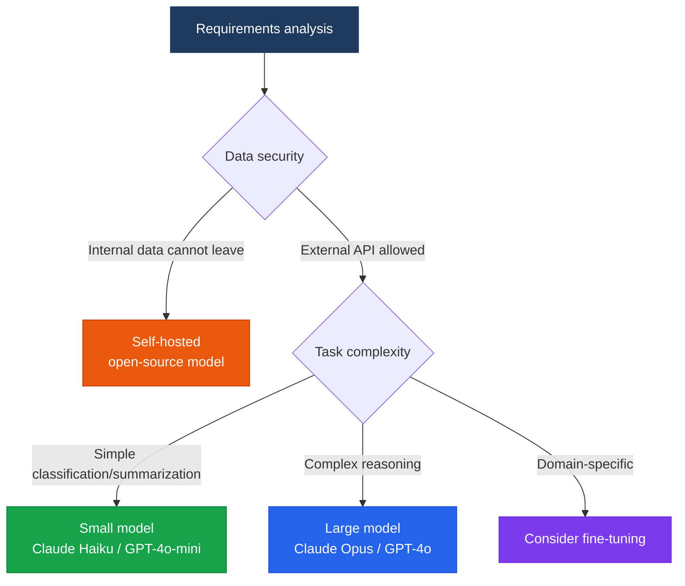

Selecting the right LLM for the purpose, plus fine-tuning and quantization strategies

## Model Selection Framework



## Major LLM Comparison (2025)

For real-time, objective metrics on performance, cost, and latency, see the [AI Model Benchmarking](./ai-model-benchmark) page.

| Model | Provider | Strengths | Context |
|---|---|---|---|
| **Claude Opus 4** | Anthropic | Complex reasoning, coding | 200K tokens |
| **Claude Sonnet 4** | Anthropic | Balanced performance/cost | 200K tokens |
| **Claude Haiku 4** | Anthropic | High speed, low cost | 200K tokens |
| **GPT-4o** | OpenAI | Multimodal, general-purpose | 128K tokens |
| **Gemini 2.0 Flash** | Google | Multimodal, speed | 1M tokens |
| **Llama 3.3** | Meta | Open-source, self-hosted | 128K tokens |

## Tuning Strategy Comparison

### Prompt Engineering
- **Best fit**: rapid prototyping, small data volumes
- **Cost**: Low
- **Effect**: Moderate

### RAG (Retrieval-Augmented Generation)
- **Best fit**: incorporating up-to-date information, injecting domain knowledge
- **Cost**: Moderate
- **Effect**: High (knowledge accuracy)

### Fine-Tuning
- **Best fit**: specific style/format, large-scale repetitive tasks
- **Cost**: High (upfront investment)
- **Effect**: High (style consistency)

## Quantization

Quantization strategies for reducing VRAM usage when self-hosting open-source models:

```
FP32 → FP16: 50% VRAM reduction, negligible performance loss
FP16 → INT8: another 50% VRAM reduction, minor performance degradation
INT8 → INT4: another 50% VRAM reduction, caution — noticeable performance degradation
```

**Recommended tools**: `llama.cpp`, `GPTQ`, `AWQ`, `bitsandbytes`
