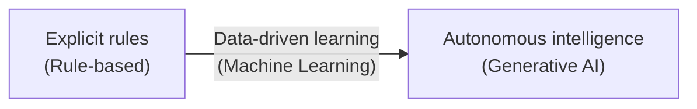
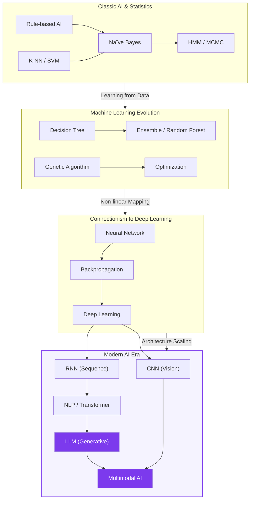

## I. A paradigm shift in intelligence — overview of AI's technical evolution

**Definition**: the technical journey from simple logic circuits and rules, through systems that learn patterns from data on their own, to systems capable of human-level generation and reasoning.

**Characteristics**:
( **Staged evolution** ) a layered progression through statistics, machine learning, and deep learning to large language models
( **Expanding generality** ) moving from performance tuned for a narrow domain toward general-purpose AI ( **AGI** ) applicable across every industry

## II. Detailed classification and mechanisms of AI technology

### A. The mechanics of AI's technical evolution

### B. Role and evolutionary stage of each major model

| Stage | Key models | Core contribution & relationship |
| :--- | :--- | :--- |
| **Stage 1**: Rules & statistics | **Rule-based**, **Naïve Bayes**, **HMM** | Solve explicit problems by directly injecting human knowledge or relying on statistical probability |
| **Stage 2**: Feature-based learning | **Decision Tree**, **SVM**, **K-NN** | Extract **features** from data and classify by finding geometric/logical boundaries |
| **Stage 3**: Neural networks & optimization | **Neural Network**, **Backpropagation** | Mimic biological neurons and build complex learning systems via error backpropagation through differentiation |
| **Stage 4**: Deep learning ( **DL** ) | **Deep Learning**, **CNN**, **RNN** | Stack layers deeply to automate high-level abstraction of data (specialized for images, time series) |
| **Stage 5**: Large models & generation | **NLP**, **LLM**, **Multimodal AI** | Achieve human-level language understanding and multi-sense integration via self-supervised learning and attention |

## III. Complementary relationships and trends across technologies

### A. Interaction between technologies

1.  **Deterministic vs. probabilistic logic**: the reliability of **rule-based** systems is being combined with the flexibility of **neural networks** into **neuro-symbolic AI**.
2.  **Global vs. local optimization**: techniques such as **genetic algorithms** and **MCMC** are used for hyperparameter optimization to find global optima that **backpropagation** alone can miss.
3.  **From simple classification to complex generation**: where **SVM** and **K-NN** focused on classifying structured data, **Transformer**-based **LLMs** evolved to learn the *relationships* between data and generate new content.

---


**Study guide** — The list in the left sidebar is ordered by the complexity and historical emergence of each technique, from foundational **Rule-based AI** through to the most recent **Multimodal AI**. Working through it in order will give you an organic understanding of both the foundations of AI technology and its most recent trends.

