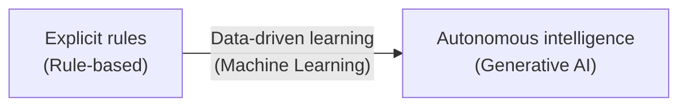
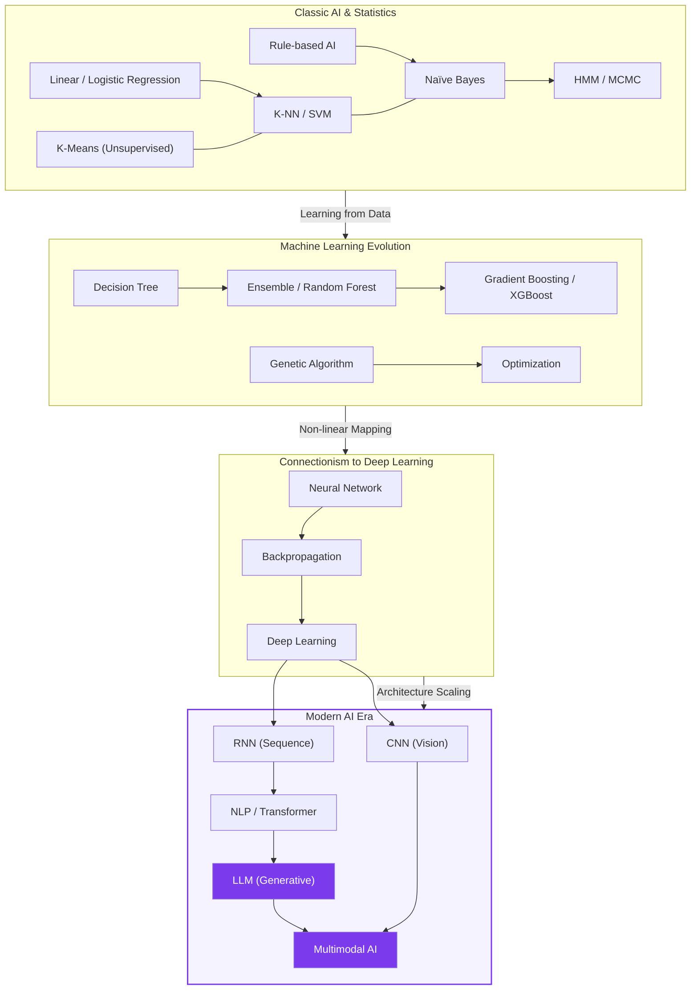

## I. A paradigm shift in intelligence — overview of AI's technical evolution

```mermaid
graph LR
    A1["Explicit rules<br/>(Rule-based)"] -- "Data-driven learning<br/>(Machine Learning)" --> B1["Autonomous intelligence<br/>(Generative AI)"]
```

**Definition**: the technical journey from simple logic circuits and rules, through systems that learn patterns from data on their own, to systems capable of human-level generation and reasoning.

**Characteristics**:
( **Staged evolution** ) a layered progression through statistics, machine learning, and deep learning to large language models
( **Expanding generality** ) moving from performance tuned for a narrow domain toward general-purpose AI ( **AGI** ) applicable across every industry

## II. Detailed classification and mechanisms of AI technology

### A. The mechanics of AI's technical evolution

```mermaid
flowchart TD
    subgraph S1["Classic AI & Statistics"]
        A2["Rule-based AI"] --> B2["Naïve Bayes"]
        B2 --> C2["HMM / MCMC"]
        D2["K-NN / SVM"] --- B2
        R2["Linear / Logistic Regression"] --> D2
        KM2["K-Means (Unsupervised)"] --- D2
    end

    subgraph S2["Machine Learning Evolution"]
        E2["Decision Tree"] --> F2["Ensemble / Random Forest"]
        F2 --> X2["Gradient Boosting / XGBoost"]
        G2["Genetic Algorithm"] --> H2["Optimization"]
    end

    subgraph S3["Connectionism to Deep Learning"]
        I2["Neural Network"] --> J2["Backpropagation"]
        J2 --> K2["Deep Learning"]
    end

    subgraph S4["Modern AI Era"]
        K2 --> L2["CNN (Vision)"]
        K2 --> M2["RNN (Sequence)"]
        M2 --> N2["NLP / Transformer"]
        N2 --> O2["LLM (Generative)"]
        O2 --> P2["Multimodal AI"]
        L2 --> P2
    end

    S1 -- "Learning from Data" --> S2
    S2 -- "Non-linear Mapping" --> S3
    S3 -- "Architecture Scaling" --> S4

    style S4 fill:#f5f3ff,stroke:#7c3aed,stroke-width:2px
    style O2 fill:#7c3aed,color:#fff
    style P2 fill:#7c3aed,color:#fff
```

### B. Role and evolutionary stage of each major model

| Stage | Key models | Core contribution & relationship |
| :--- | :--- | :--- |
| **Stage 1**: Rules & statistics | **Rule-based**, **Linear / Logistic Regression**, **Naïve Bayes**, **HMM** | Solve explicit problems by directly injecting human knowledge or relying on statistical probability |
| **Stage 2**: Feature-based learning | **Decision Tree**, **SVM**, **K-NN**, **K-Means**, **XGBoost** | Extract **features** from data and classify by finding geometric/logical boundaries |
| **Stage 3**: Neural networks & optimization | **Neural Network**, **Backpropagation** | Mimic biological neurons and build complex learning systems via error backpropagation through differentiation |
| **Stage 4**: Deep learning ( **DL** ) | **Deep Learning**, **CNN**, **RNN** | Stack layers deeply to automate high-level abstraction of data (specialized for images, time series) |
| **Stage 5**: Large models & generation | **NLP**, **LLM**, **Multimodal AI** | Achieve human-level language understanding and multi-sense integration via self-supervised learning and attention |

### C. How models learn — the training paradigms

The stages above describe *what* was built. Cutting across all of them is *how* a model is trained, which is decided by the shape of the data available:

| Paradigm | What the data looks like | What the model learns | Where it appears |
| :--- | :--- | :--- | :--- |
| **Supervised** | Labeled input/output pairs | A mapping from input to a known answer | [Linear Regression](linear-regression), [Logistic Regression](logistic-regression), [Decision Tree](decision-tree), [SVM](svm), [K-NN](knn) |
| **Unsupervised** | Unlabeled data | Latent structure — clusters, density, compressed representations | [K-Means clustering](k-means), dimensionality reduction, embedding spaces |
| **Reinforcement** | A reward signal from an environment | A policy that maximizes cumulative reward | RLHF alignment of an [LLM](llm) |
| **Self-supervised** | Unlabeled data, with the labels derived from the data itself | General representations, before any task is specified | [LLM](llm) pre-training via next-token prediction |

The data itself also splits along a line that decides which family of model applies at all:

| Data type | Examples | What handles it well |
| :--- | :--- | :--- |
| **Structured** (tabular) | Rows and columns — transactions, sensor logs, customer records | Classical ML: [gradient boosting](gradient-boosting), [ensembles and random forests](ensemble-random-forest), [decision trees](decision-tree), [linear models](linear-regression) |
| **Unstructured** | Text, images, audio, video | Deep learning: [CNN](cnn) for vision, [RNN](rnn) and [Transformer](transformer) for sequence, [multimodal models](multimodal-ai) across several at once |

### D. The machine learning lifecycle

Independent of technique, a model that reaches production passes through the same loop:

```mermaid
flowchart LR
    A["1. Data collection"] --> B["2. Preprocessing<br/>cleaning, labeling, splitting"]
    B --> C["3. Training"]
    C --> D["4. Evaluation"]
    D --> E["5. Deployment"]
    E --> F["6. Monitoring"]
    F -.->|"drift, new data"| A

    style A fill:#EFF6FF,stroke:#2563EB,color:#1E40AF
    style B fill:#2563EB,stroke:#1D4ED8,color:#fff
    style C fill:#7C3AED,stroke:#6D28D9,color:#fff
    style D fill:#EA580C,stroke:#C2410C,color:#fff
    style E fill:#16A34A,stroke:#15803D,color:#fff
    style F fill:#0891B2,stroke:#0E7490,color:#fff
```

Two rules govern step 2 and step 4. Data is split into **training, validation, and test** sets, and the test set is touched only once, at the end — a model evaluated on data it trained on reports a score that will not survive contact with production. And accuracy alone is the wrong measure whenever classes are imbalanced:

| Metric | What it answers | When it matters |
| :--- | :--- | :--- |
| **Accuracy** | What fraction of all predictions were right? | Balanced classes only — 99% accuracy is meaningless when 99% of cases are negative |
| **Precision** | Of the cases flagged positive, how many really were? | False positives are expensive — spam filters, fraud alerts sent to customers |
| **Recall** | Of the real positives, how many did we catch? | False negatives are expensive — disease screening, defect detection |
| **F1** | Harmonic mean of precision and recall | A single number when both errors carry weight |
| **Confusion matrix** | The full breakdown of true/false positives and negatives | Diagnosing *which* error the model is making, before choosing what to optimize |

Precision and recall trade against each other; which one you sacrifice is a business decision, not a modeling one. In the generative era, the same lifecycle still applies, but steps 3 and 4 usually mean [tuning a foundation model](/docs/infrastructure/model-selection/) and [benchmarking it](/docs/infrastructure/ai-model-benchmark/) rather than training from scratch.

## III. Complementary relationships and trends across technologies

### A. Interaction between technologies

1.  **Deterministic vs. probabilistic logic**: the reliability of **rule-based** systems is being combined with the flexibility of **neural networks** into **neuro-symbolic AI**.
2.  **Global vs. local optimization**: techniques such as **genetic algorithms** and **MCMC** are used for hyperparameter optimization to find global optima that **backpropagation** alone can miss.
3.  **From simple classification to complex generation**: where **SVM** and **K-NN** focused on classifying structured data, **Transformer**-based **LLMs** evolved to learn the *relationships* between data and generate new content.

---


**Study guide** — The list in the left sidebar is ordered by the complexity and historical emergence of each technique, from foundational **Rule-based AI** through to the most recent **Multimodal AI**. Working through it in order will give you an organic understanding of both the foundations of AI technology and its most recent trends.

