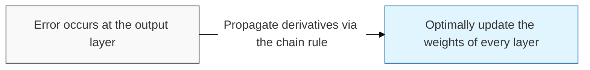
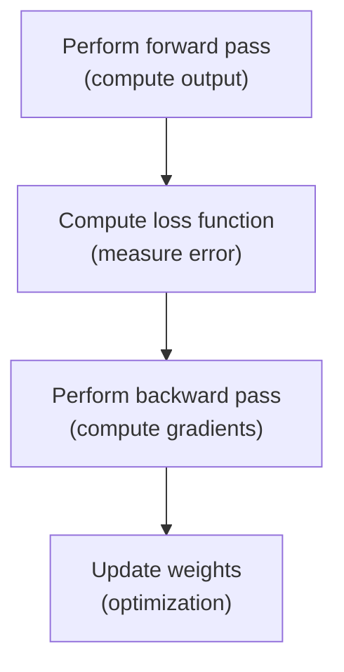

## I. Propagating error backward via the chain rule — overview of Backpropagation

**Definition**: a derivative-based learning algorithm that propagates the error ( **Error** ) between a neural network's output and the true value backward through the network to efficiently update the weights ( **Weights** ) of each layer

**Characteristics**:
( **Chain Rule** ) uses the chain rule of differentiation ( **Chain Rule** ) to compute each weight's contribution even in a multi-layer structure
( **Efficiency** ) reduces computational complexity by solving for the partial derivatives of all weights in a single backward pass
( **Foundation for Optimization** ) combined with gradient descent ( **Gradient Descent** ), it is the key driving force that lets a neural network converge to the target function

## II. Detailed mechanism and mathematical structure of Backpropagation

### A. The four-stage process of the backpropagation algorithm

### B. Core components and mathematical principles

| Component | Detailed Description | Notes |
| :--- | :--- | :--- |
| **Chain Rule** | The principle of expressing the derivative of a composite function as the product of the derivatives of its sub-functions | **Chain Rule** |
| **Loss Function** | Quantifies the model's prediction error (e.g., **MSE**, **Log Loss**) | **Loss Function** |
| **Gradient** | The derivative of the loss function with respect to the weights, which determines the direction of the update | **Gradient** |
| **Learning Rate** | The constant that determines how much a weight is updated at each step | **Learning Rate** |

## III. Limitations and mitigation techniques of Backpropagation

| Item | Issue | Solution |
| :--- | :--- | :--- |
| **Vanishing Gradient** | Gradients converge toward zero as layers get deeper ( **Vanishing** ) | **ReLU**, **Batch Norm**, **ResNet** |
| **Exploding Gradient** | Gradients grow explosively, destabilizing training ( **Exploding** ) | **Gradient Clipping**, **Weight Initialization** |
| **Local Minima** | Getting trapped in a local dip rather than the global minimum ( **Local Minima** ) | **Momentum**, **Adam**, **Stochasticity** |

**Technology trends**: early backpropagation algorithms struggled to train deep networks, but changes to activation functions and the introduction of normalization techniques became the decisive turning point that ushered in the **Deep Learning** era
