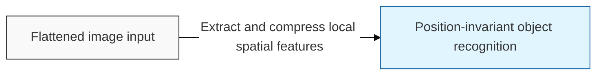
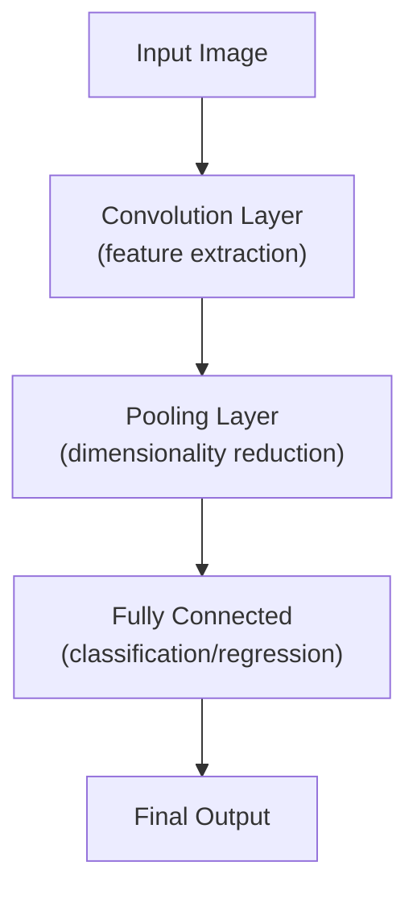

## I. Preserving spatial information and extracting features — overview of CNN

**Definition**: a neural network architecture that uses convolution operations to extract local features while preserving an image's spatial structure ( **Spatial Structure** )

**Characteristics**:
( **Translation Invariance** ) secures translation invariance ( **Translation Invariance** ), recognizing a feature identically regardless of where it appears in the image
( **Parameter Sharing** ) sharing filters dramatically reduces the number of parameters to be learned compared to a fully connected network
( **Hierarchical Structure** ) lower layers learn lines and points, while higher layers progressively learn the shapes of complex objects

## II. Major operations and layers of CNN

### A. The feature-extraction and classification process of CNN

### B. Core components and functions

| Component | Detailed Description | Key Keyword |
| :--- | :--- | :--- |
| **Filter** (Kernel) | A weight matrix that slides over the image to extract local features | **Shared Weights** |
| **Stride** | The interval at which the filter moves, controlling the size of the output data | **Step Size** |
| **Padding** | Fills the border with a specific value (e.g., 0) to preserve output size and prevent loss of edge information | **Zero Padding** |
| **Pooling** | Extracts a representative value (max/average) from a region to compress features and remove noise | **Sub-sampling** |

## III. Evolution of representative CNN models

| Model | Key Innovation | Notes |
| :--- | :--- | :--- |
| **LeNet**-5 | The first practical **CNN** architecture (check-digit recognition) | 1998, Yann LeCun |
| **AlexNet** | Sparked the deep learning boom by introducing **GPU** usage, **ReLU**, and **Dropout** | Won ImageNet 2012 |
| **VGGNet** | Proved the efficiency of stacking small 3x3 filters deeply | Simple, deep structure |
| **ResNet** | Succeeded in training networks over 100 layers deep via residual learning (skip connections) | Solved vanishing gradients |

**Technology trends**: today CNNs continue to advance not only in image recognition but also in autonomous driving, medical image interpretation, and, combined with Vision Transformers ( **ViT** ), increasingly sophisticated visual intelligence
