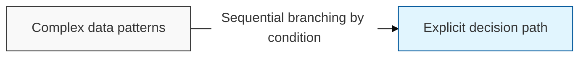
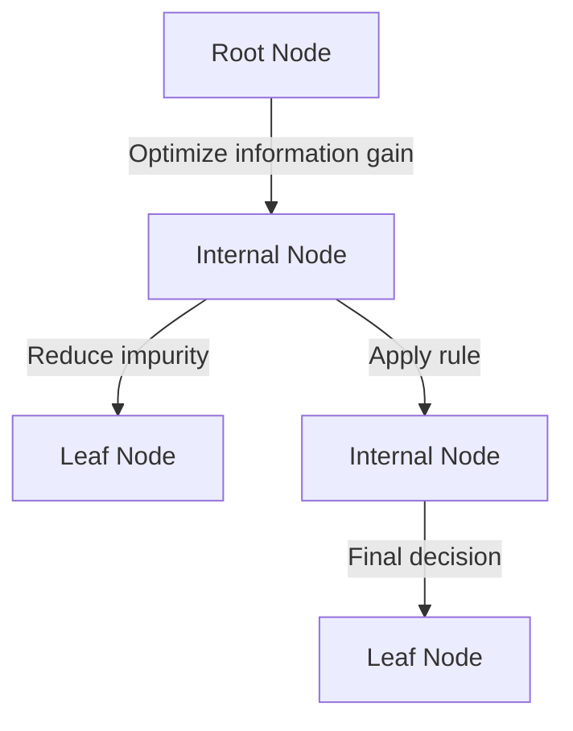

## I. Intuitive rule-based decision-making — overview of Decision Tree

**Definition**: a rule-based algorithm that splits the entire training dataset into subgroups according to specific conditions, diagrams the result as a tree ( **Tree** ) structure, and uses it to perform classification and regression

**Characteristics**:
( **High Readability** ) a `"**White-box**"` model that visualizes the decision-making process, so even non-experts can easily grasp the reasoning behind it
( **Data Flexibility** ) largely unaffected by complex preprocessing such as normalization or scaling, and able to handle numerical and categorical data simultaneously
( **Intuitive Interpretation** ) results emerge from a combination of rules that flow from the top node down to lower nodes, giving the logic very strong explanatory power

## II. Detailed mechanisms and components of Decision Tree

### A. The splitting mechanism of a decision tree

### B. Core metrics and detailed functions

| Component | Detailed Description | Notes |
| :--- | :--- | :--- |
| **Information Entropy** | Represents the disorder of a dataset — a metric for measuring uncertainty before and after a split | **Entropy** |
| **Gini Index** | Represents the impurity of the data; splits are made in the direction that minimizes this value | **Gini Index** |
| **Information Gain** | The amount of entropy reduced by a split, used as the criterion for variable selection | **Information Gain** |
| **Pruning** | A technique that reduces model complexity and removes lower branches to prevent overfitting | **Pruning** |

## III. Technical challenges and future direction of Decision Tree

### A. Limitations and mitigation strategies

| Item | Detailed Content | Solution |
| :--- | :--- | :--- |
| **Overfitting** | Generalization performance degrades because the model reacts too precisely to the training data | Apply **Pruning**, set **Max Depth** |
| **Model Instability** | The overall tree structure can change dramatically even with small changes in the data | Apply **Ensemble** techniques |
| **Biased Splitting** | A tendency to preferentially select variables with a large number of categories | Use corrective metrics such as **Gain Ratio** |

### B. Technology trends

( **Ensemble Evolution** ) to overcome the limitations of a single tree, decision trees have evolved into powerful ensemble-based models such as **Random Forest**, **XGBoost**, and **LightGBM**.
( **Explainable AI** ) decision trees still play a key role as a surrogate model ( **Surrogate Model** ) used to explain the decisions of complex deep learning models.
