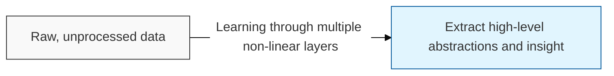
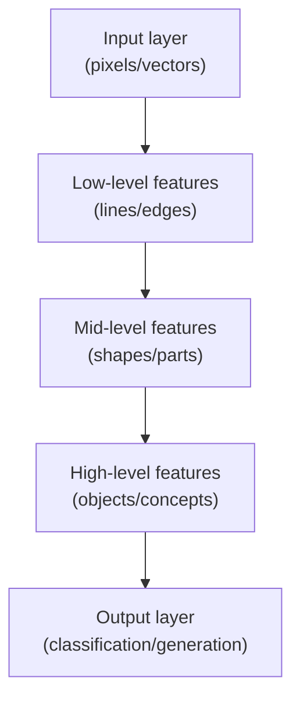

# Deep Learning

## I. High-level abstraction through deep neural networks — overview of Deep Learning

**Definition**: a branch of machine learning that stacks deep hidden layers ( **Hidden Layers** ) in a neural network to automatically and hierarchically extract and learn complex features from data

**Characteristics**:
( **Feature Learning** ) the model learns directly from the data rather than requiring humans to hand-design features ( **Feature Engineering** )
( **End-to-End Learning** ) an **End-to-End** approach in which a single massive neural network connects everything from input to output
( **Scalability** ) a tendency for performance to keep improving as data and computing resources ( **GPU** ) increase

## II. Layered structure and core elements of Deep Learning

### A. Data flow and representation learning in deep learning

### B. Three key factors behind deep learning's success

| Factor | Detailed Content | Contribution |
| :--- | :--- | :--- |
| **Big Data** | Access to massive training datasets from social media, **IoT**, and other sources | Secures the model's generalization performance |
| **Compute Power** | Advances in massively parallel computing devices such as **GPU**s and **TPU**s | Shortens training time for deep networks |
| **Algorithmic Innovation** | The emergence of techniques such as **ReLU**, **Dropout**, and **Batch Norm** | Solves the vanishing-gradient problem |

## III. Major architectures and applications of Deep Learning

| Architecture | Core Characteristic | Key Applications |
| :--- | :--- | :--- |
| **CNN** | Spatial feature extraction ( **Spatial Features** ) | Image recognition, medical image analysis |
| **RNN**/**LSTM** | Sequential data processing ( **Sequential Data** ) | Translation, time-series forecasting, speech recognition |
| **Transformer** | Parallel attention mechanism ( **Self-Attention** ) | **LLM**, natural language understanding and generation |
| **GAN** | Adversarial training between a generator and a discriminator | Image synthesis, style transfer |

**Technology trends**: deep learning is now evolving beyond simple classification into generative AI ( **Generative AI** ), and massive models with extremely large parameter counts — foundation models ( **Foundation Model** ) — have become the industry standard
