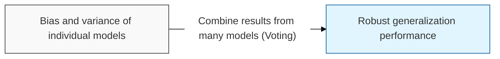

## I. Maximizing predictive power through collective intelligence — overview of Ensemble & Random Forest

**Definition**: a technique ( **Ensemble** ) that organically combines multiple weak learners ( **Weak Learner** ) into a single strong learner, together with the **Random Forest** algorithm, which applies this technique to decision trees

**Characteristics**:
( **Generalization Performance** ) combining multiple models offsets the overfitting problems of individual models and improves predictive power on unseen data
( **Diversity** ) forms a group of models with different characteristics through random sampling ( **Bagging** ) and random feature selection ( **Randomness** )
( **High Robustness** ) the influence of noise or outliers ( **Outlier** ) in the data is diluted, producing more stable results than a single model

## II. Detailed mechanisms and components of Ensemble

### A. The ensemble mechanism of Random Forest

### B. Core components and detailed functions

| Component | Detailed Description | Notes |
| :--- | :--- | :--- |
| **Bootstrapping** | Generates multiple distinct training sets through random sampling with replacement | **Sampling** |
| **Aggregating** | The process of combining each model's predictions via majority vote (classification) or arithmetic mean (regression) | **Bagging** |
| **Feature Randomness** | Considers only a randomly selected subset of variables when splitting a node, reducing correlation between trees | **Diversity** |
| **OOB Score** | Uses the data excluded from sampling ( **Out-of-Bag** ) to evaluate the model without separate validation | **Validation** |

## III. Comparison and future direction of Ensemble techniques

### A. Comparing the three core ensemble techniques

| Comparison Item | Bagging | Boosting | Stacking |
| :--- | :--- | :--- | :--- |
| **Core Principle** | Parallel model training and averaging | Sequential training with error correction | Retraining on model outputs (meta-model) |
| **Primary Goal** | Reduce variance ( **Variance** ) | Reduce bias ( **Bias** ) | Maximize predictive performance |
| **Representative Algorithms** | **Random Forest** | **XGBoost**, **LightGBM** | **Meta Learner** |

### B. Technology trends

( **SOTA for Tabular** ) while deep learning dominates unstructured data, ensemble tree models continue to deliver the best performance on structured-data domains such as finance and commerce.
( **Hyperparameter Auto** ) they are increasingly combined with **AutoML** techniques to automatically optimize complex ensemble structures and parameters.
