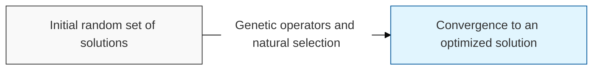

# Genetic Algorithm

## I. Engineering natural selection and evolution — overview of Genetic Algorithm

**Definition**: a stochastic search algorithm that finds solutions to optimization problems by imitating natural selection ( **Natural Selection** ) and the laws of genetics — the process by which living organisms evolve

**Characteristics**:
( **Global Search** ) pursues a global optimum ( **Global Optimum** ) by randomly exploring the entire solution space rather than relying on the gradient at a particular point
( **Stochastic Model** ) solves complex non-linear problems through stochastic rather than deterministic techniques
( **Generality** ) applicable regardless of whether the objective function is non-differentiable or discontinuous

## II. Core operators and process of the Genetic Algorithm

### A. The three main stages of evolution

### B. Algorithm components and detailed functions

| Component | Detailed Description | Notes |
| :--- | :--- | :--- |
| **Chromosome** | The data structure representing a solution to the problem (typically binary strings or vectors) | **Individual** |
| **Fitness Function** | A measure of how close an individual is to the optimal solution | **Objective Function** |
| **Selection** | Selects individuals with high fitness as parents for the next generation (e.g., roulette wheel, tournament) | **Survival of Fittest** |
| **Crossover** | Combines the genetic information of two parents to produce new offspring | **Exploitation** |
| **Mutation** | Randomly alters part of the genetic information to maintain diversity and escape local optima | **Exploration** |

## III. Applications and limitations of the Genetic Algorithm

| Item | Detailed Content |
| :--- | :--- |
| **Key Applications** | Scheduling optimization, network route design, neural architecture search ( **NAS** ), complex engineering design |
| **Limitations** | Difficulty designing the **Fitness** function, slow convergence speed, sensitivity to parameter settings (e.g., mutation rate) |
| **Future Direction** | Widely used in combination with reinforcement learning ( **RL** ) or as a hyperparameter optimization tool for deep learning models |

**Technology trends**: beyond traditional optimization techniques, active research is now underway on **Neuroevolution**, which evolves the weights of a neural network in massively parallel computing environments
