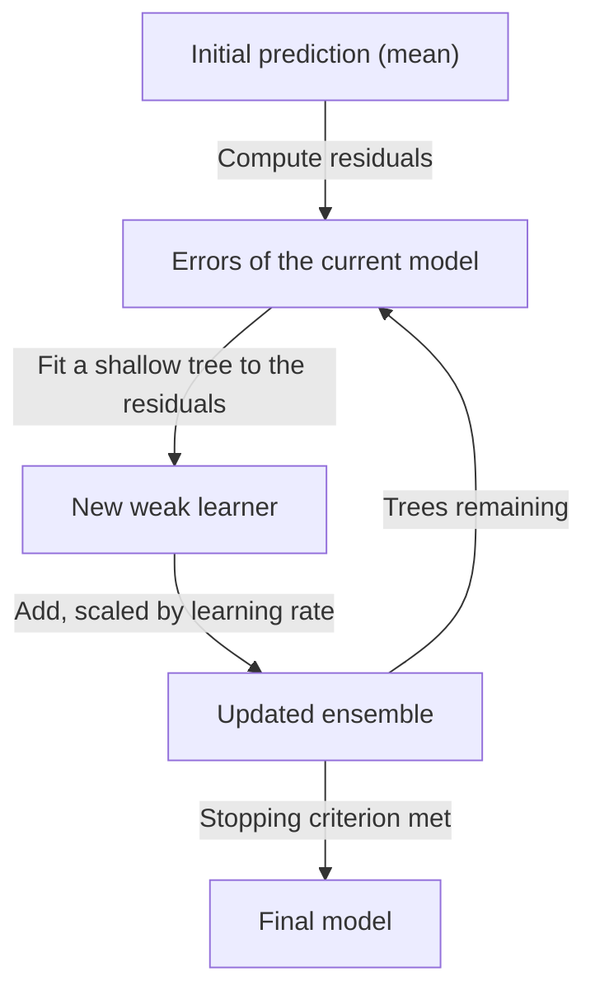

## I. Learning from the previous model's mistakes — overview of Gradient Boosting

**Definition**: an ensemble technique that builds shallow [decision trees](/docs/infrastructure/models/decision-tree/) **sequentially**, where each new tree is fitted to the errors ( **Residuals** ) still left by the trees before it, and the final prediction is the sum of all of them

**Characteristics**:
( **Sequential, not parallel** ) this is the dividing line against [Random Forest](/docs/infrastructure/models/ensemble-random-forest/) — bagging trains independent trees in parallel to reduce variance, while boosting trains dependent trees in sequence to reduce bias
( **State of the Art on Tabular Data** ) on structured, row-and-column data it consistently outperforms deep learning, which is why it dominates competitive machine learning and production credit, pricing, and demand models
( **Tuning-Sensitive** ) the same mechanism that drives accuracy — fitting the residual repeatedly — will fit noise just as willingly if left unconstrained

## II. Detailed mechanisms and components of Gradient Boosting

### A. The training mechanism of Gradient Boosting

### B. Core components and detailed functions

| Component | Detailed Description | Notes |
| :--- | :--- | :--- |
| **Residual Fitting** | Each tree learns what the current ensemble still gets wrong, rather than the original target | **Boosting** |
| **Learning Rate** | Shrinks each tree's contribution — a lower rate needs more trees but generalizes better | **Shrinkage** |
| **Tree Depth** | Kept shallow deliberately, so that each learner stays weak and the ensemble does the work | **Weak Learner** |
| **Regularization** | Penalties on leaf count and leaf weights, which is XGBoost's main addition over classical boosting | **L1 / L2** |
| **Early Stopping** | Halts training when validation error stops improving, the primary defense against overfitting | **Validation Set** |

## III. Technical challenges and trends of Gradient Boosting

### A. Comparing the major implementations

| Implementation | Distinguishing approach | Best suited for |
| :--- | :--- | :--- |
| **XGBoost** | Regularized objective, second-order gradients, mature tooling | The default choice; broadest ecosystem support |
| **LightGBM** | Leaf-wise growth and histogram binning for speed | Large datasets where training time dominates |
| **CatBoost** | Native handling of categorical features without manual encoding | Data with many high-cardinality categorical columns |

### B. Limitations and technology trends

| Item | Detailed Content | Solution |
| :--- | :--- | :--- |
| **Overfitting Risk** | Sequential error-fitting will memorize noise if trees or iterations are unbounded | Early stopping, lower learning rate, depth limits |
| **Compute Cost** | Sequential dependency prevents the parallelism that makes Random Forest cheap to train | Histogram-based splitting, GPU training |
| **Interpretability** | Hundreds of interacting trees are not readable the way a single tree is | **SHAP** values, feature importance |

( **AutoML Integration** ) it is the model most automated pipelines reach for on tabular problems, with hyperparameter search wrapped around it rather than replaced by it.
( **Tabular vs Deep Learning** ) despite repeated attempts to displace it with neural architectures, boosted trees remain the benchmark to beat on structured data — a useful reminder that the newest model family is not automatically the right one.
