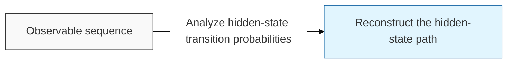
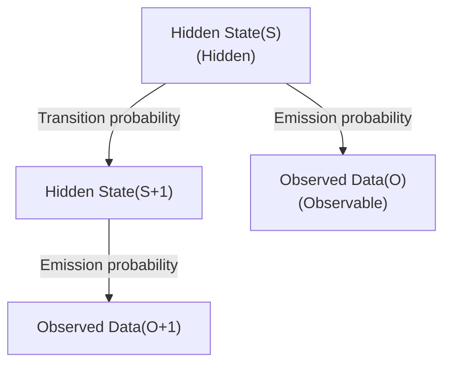

# Hidden Markov Model (HMM)

## I. Inferring hidden states behind observed data — overview of HMM

**Definition**: a statistical Markov model in which the system's state cannot be observed directly, but the transitions and probabilities of the hidden state ( **Hidden State** ) are inferred from observable data

**Characteristics**:
( **Markov Property** ) the memoryless ( **Memoryless** ) assumption that the future state is determined solely by the current state
( **Dual Stochastic Process** ) a two-layer probability structure consisting of transitions ( **Transition** ) between states and the emission ( **Emission** ) of data
( **Sequence-Specialized** ) well suited to pattern recognition and sequential data processing over time, such as speech recognition and stock-price prediction

## II. Detailed mechanisms and components of HMM

### A. The inference mechanism of HMM

### B. Core components and the three key algorithms

| Category | Component / Algorithm | Detailed Function and Role |
| :--- | :--- | :--- |
| **Model Parameters** | **Initial / Transition / Emission** | Initial state probability, state-transition probability matrix, and observation-generation probability |
| **Evaluation** | **Forward / Backward** | Computes the probability that a specific sequence occurs, given the model parameters |
| **Decoding** | **Viterbi Algorithm** | Searches for the most probable hidden-state path that could have generated the observed sequence |
| **Learning** | **Baum-Welch**(EM) | Iteratively optimizes the model's parameters from observed data |

## III. Applications and technology trends of HMM

### A. Major application areas

| Field | Use Case | Detailed Content |
| :--- | :--- | :--- |
| **NLP** | **POS Tagging** | Automatically tags the part of speech of each word in a sentence based on context |
| **Bioinformatics** | **Gene Prediction** | Identifies protein-coding regions within a gene sequence |
| **Speech Recognition** | **Speech-to-Text** | Infers the corresponding word sequence from an input speech signal |

### B. Technology trends and evolution

( **Deep Learning Fusion** ) hybrid models combine the statistical structure of the classic HMM with the powerful context-retention ability of **RNN/LSTM** networks.
( **Statistical Robustness** ) compared to deep learning, HMMs require less computation and offer a clearer model structure, so they remain preferred in certain data-scarce domains.
