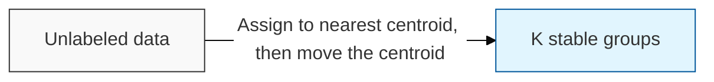
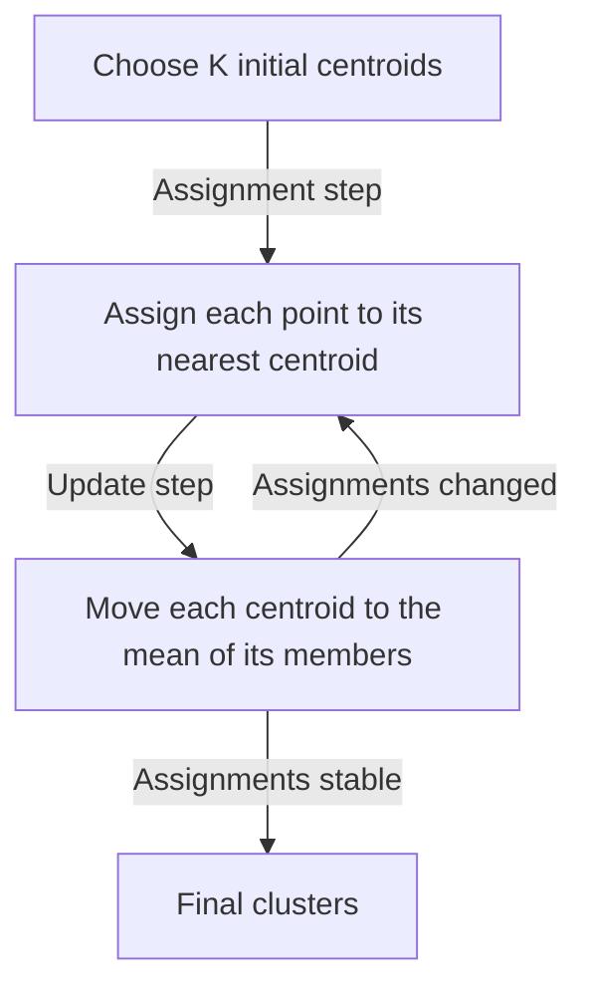

## I. Finding groups without labels — overview of K-Means Clustering

**Definition**: an **unsupervised** learning algorithm that partitions data into **K** groups without any labels, by repeatedly assigning each point to the nearest centroid and recomputing each centroid as the mean of the points assigned to it, until the assignments stop changing

**Characteristics**:
( **No Ground Truth** ) there is no correct answer to learn from — the algorithm discovers structure rather than reproducing a known label, which makes evaluation a judgment call rather than a score
( **Iterative Convergence** ) alternating assignment and update is guaranteed to converge, but only to a local optimum that depends on the initial centroids
( **Distinct from K-NN** ) the shared "K" causes constant confusion: [K-NN](/docs/infrastructure/models/knn/) is supervised and classifies one new point using labeled neighbors, while K-Means is unsupervised and partitions an entire unlabeled dataset

## II. Detailed mechanisms and components of K-Means

### A. The clustering mechanism of K-Means

### B. Core components and detailed functions

| Component | Detailed Description | Notes |
| :--- | :--- | :--- |
| **Centroid** | The mean position of a cluster's members, serving as that cluster's representative point | **Cluster Center** |
| **K-Value** | The number of clusters, which must be fixed in advance by the practitioner rather than learned | **Hyperparameter** |
| **Inertia** | The total squared distance from each point to its centroid — the quantity the algorithm minimizes | **Within-Cluster SSE** |
| **Initialization** | The choice of starting centroids, which decides which local optimum is reached | **K-Means++** |

## III. Technical challenges and trends of K-Means

### A. Limitations and optimization strategies

| Item | Detailed Content | Solution |
| :--- | :--- | :--- |
| **Choosing K** | The number of clusters is an input, not an output, and a wrong K produces confident but meaningless groups | **Elbow Method**, **Silhouette Score** |
| **Cluster Shape Assumption** | Only roughly spherical, similarly sized clusters are recovered; elongated or nested shapes are split incorrectly | **DBSCAN**, **Gaussian Mixture Model** |
| **Initialization Sensitivity** | Poor starting centroids converge to a bad partition | **K-Means++**, multiple restarts |
| **Outliers** | Because centroids are means, a few extreme points pull a cluster center away from its members | **K-Medoids**, outlier removal |

### B. Technology trends

( **Customer Segmentation** ) it remains the standard first pass for segmentation, anomaly grouping, and image color quantization, because it is fast, explainable, and needs nothing labeled.
( **Embedding Clustering** ) applied to [embedding vectors](/docs/infrastructure/vector-db/) rather than raw features, it groups semantically similar documents or users, and is used to organize retrieval corpora and deduplicate large text collections.
