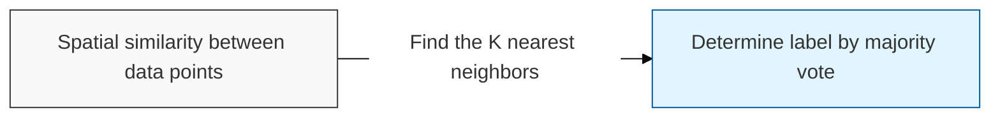
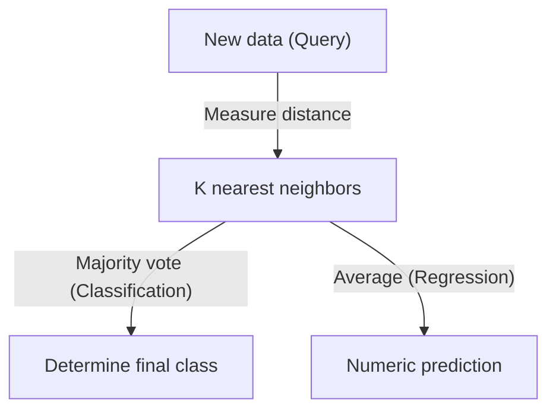

# K-Nearest-Neighbor (K-NN)

## I. Intuitive classification based on similarity — overview of K-NN

**Definition**: an instance-based learning ( **Instance-based Learning** ) algorithm that measures the distance between a new data point and an existing dataset, then classifies or predicts the result according to the labels of the **K** nearest neighboring data points

**Characteristics**:
( **Lazy Learning** ) a `"**Lazy Learning**"` approach that performs no computation to build a model beforehand and only computes at prediction time
( **Non-parametric Model** ) makes no assumption about a specific distribution shape for the data, so it is flexible and applicable to a wide variety of data structures
( **Data-driven** ) an intuitive mechanism that derives results relying solely on data density and similarity in the feature space

## II. Detailed mechanisms and components of K-NN

### A. The inference mechanism of K-NN

### B. Core components and detailed functions

| Component | Detailed Description | Notes |
| :--- | :--- | :--- |
| **K-Value** | The number of neighbors that participate in the result — determines model complexity and generalization performance | **Bias-Variance** |
| **Distance Metric** | A distance function such as Euclidean or Manhattan distance that quantifies similarity between data points | **L1 / L2 Distance** |
| **Feature Scaling** | Standardizes the range of the data so that no single variable dominates disproportionately | **Normalization** |
| **Voting Mechanism** | Derives the final result via majority voting or weighting proportional to distance | **Weighting** |

## III. Technical challenges and trends of K-NN

### A. Limitations and optimization strategies

| Item | Detailed Content | Solution |
| :--- | :--- | :--- |
| **Curse of Dimensionality** | As the number of features (dimensions) increases, distances between data points grow and discriminative power is lost | Apply dimensionality reduction ( **PCA** ) |
| **Computational Complexity** | Requires computing the distance to every training data point, causing latency on large datasets | **KD-Tree**, **Ball-Tree** |
| **Sensitivity to Outliers** | An inappropriate **K** value distorts results due to noise or outliers | Optimize **K** via cross-validation |

### B. Technology trends

( **Vector Database** ) it is drawing renewed attention as the foundational technology behind `"**Vector Search**"`, which quickly finds similar data among large-scale embeddings.
( **ANN** ) it is evolving into Approximate Nearest Neighbor ( **Approximate Nearest Neighbor** ) technology, which finds approximate rather than exact neighbors to maximize computational efficiency.
