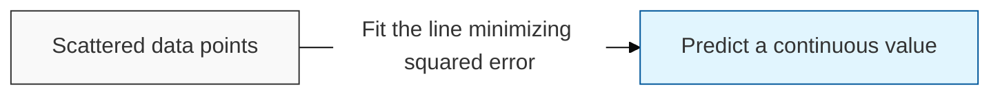
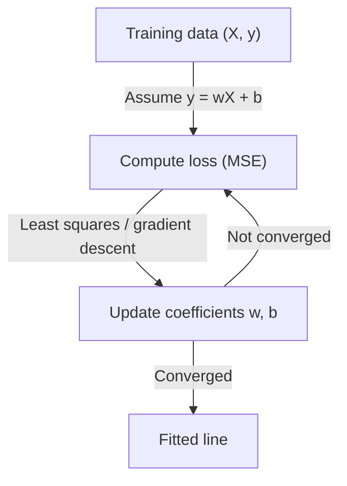

## I. Predicting continuous values with a straight line — overview of Linear Regression

**Definition**: a supervised learning algorithm that models the relationship between input variables and a continuous target as a straight line ( **Line of Best Fit** ), by finding the coefficients that minimize the sum of squared errors between predicted and actual values

**Characteristics**:
( **Continuous Output** ) unlike classification, the prediction is a number on a continuous scale — price, revenue, temperature, demand
( **Parametric Model** ) the entire model reduces to a small set of coefficients, one per feature plus an intercept
( **Full Interpretability** ) each coefficient states directly how much the target moves per unit of that feature, which is why it remains the default in domains that must explain a decision

## II. Detailed mechanisms and components of Linear Regression

### A. The training mechanism of Linear Regression

### B. Core components and detailed functions

| Component | Detailed Description | Notes |
| :--- | :--- | :--- |
| **Coefficient** | The weight of each feature — the slope, expressing how much the target changes per unit change of that feature | **Weight** |
| **Intercept** | The predicted value when every feature is zero, anchoring the line vertically | **Bias** |
| **Loss Function** | Mean squared error ( **MSE** ), which penalizes large errors quadratically | **Least Squares** |
| **R-squared** | The proportion of variance in the target explained by the model, used to judge goodness of fit | **Coefficient of Determination** |

## III. Technical challenges and trends of Linear Regression

### A. Limitations and optimization strategies

| Item | Detailed Content | Solution |
| :--- | :--- | :--- |
| **Linearity Assumption** | Only a straight-line relationship can be captured; genuinely curved relationships are systematically mispredicted | **Polynomial Regression**, feature transformation |
| **Sensitivity to Outliers** | Squared error means a single extreme point can drag the whole line toward it | **Huber Loss**, **RANSAC**, outlier removal |
| **Multicollinearity** | Highly correlated features make the coefficients unstable and their interpretation meaningless | **Ridge** ( **L2** ), **Lasso** ( **L1** ) regularization |

### B. Technology trends

( **Baseline of Record** ) it remains the reference model any complex method must beat — a gradient-boosted ensemble that fails to outperform a linear fit signals a data problem, not a model problem.
( **Interpretable AI** ) as regulation increasingly demands explainable decisions, linear models retain their position in credit scoring, insurance pricing, and clinical risk scoring precisely because their coefficients are auditable.
