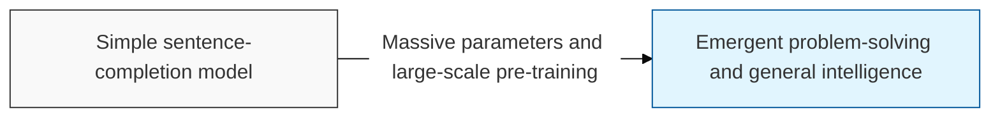
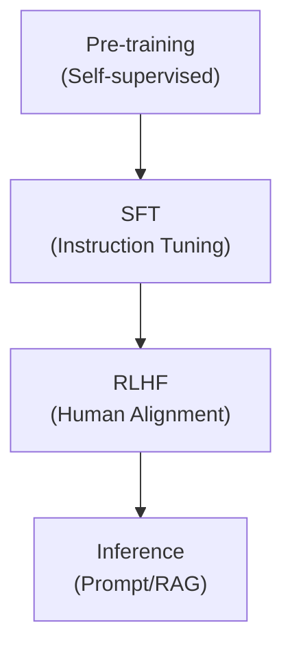

# Large Language Model (LLM)

## I. Massive parameters and emergent intelligence — overview of LLM

**Definition**: an artificial intelligence model trained on massive datasets using a huge neural network with hundreds of billions or more parameters ( **Parameters** ), maximizing natural language understanding and generation capability

**Characteristics**:
( **Emergence** ) the phenomenon of Emergent Abilities, in which specific capabilities suddenly appear once the model exceeds a certain scale
( **Generality** ) capable of performing a wide range of tasks from prompts ( **Prompt** ) alone, without separate fine-tuning
( **Knowledge Compression** ) compresses the vast body of text humanity has accumulated into the form of model weights

## II. Core architecture and training process of LLM

### A. The LLM lifecycle: from pre-training to alignment

### B. Core technical elements

| Technical Element | Detailed Description | Notes |
| :--- | :--- | :--- |
| **Transformer** | A parallel-processing architecture based on multi-head attention | **Backbone** |
| **Tokenization** | Splits text into the smallest units the model can process (e.g., **BPE**) | **Preprocessing** |
| **Attention** | A mechanism that computes the importance of relationships between words in a sentence | **Self-Attention** |
| **Scaling Law** | The law by which performance improves in proportion to data, compute, and parameter size | **Model Size** |

## III. Limitations of LLM and key mitigation strategies

| Limitation | Detailed Content | Mitigation Strategy |
| :--- | :--- | :--- |
| **Hallucination** | Producing plausible-sounding but factually incorrect answers ( **Hallucination** ) | **RAG**, **Fact**-**checking** |
| **Lack of Recency** | No knowledge of events after the training data cutoff | **Search Engine Link**, **Web Browsing** |
| **Cost and Resources** | Enormous compute and cost required for training and inference | **Quantization**, **Distillation**, **sLLM** |

**Technology trends**: LLMs are now expanding beyond text into multimodal ( **Multimodal** ) models that simultaneously process images and audio, while the market for small, domain-specialized large language models ( **sLLM** ) is also growing rapidly
