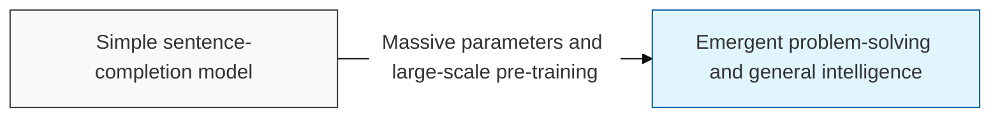
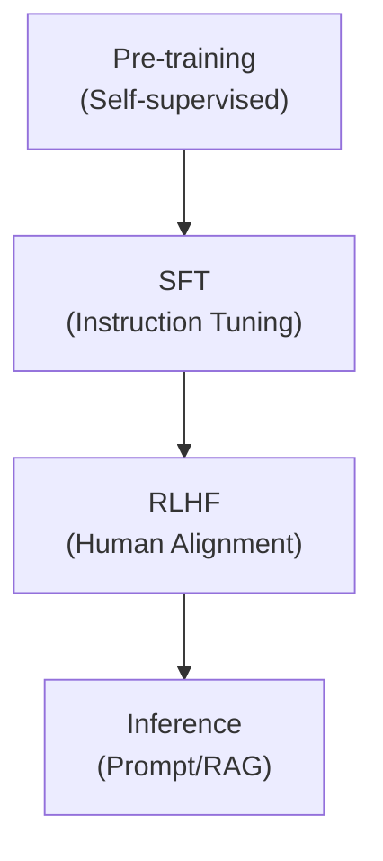
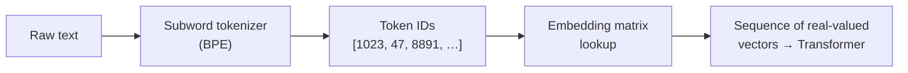

## I. Massive parameters and emergent intelligence — overview of LLM

```mermaid
%%{init: { 'theme': 'base', 'themeVariables': { 'edgeLabelBackground': '#fff' }}}%%
flowchart LR
    A1["Simple sentence-completion model"] -- "Massive parameters and large-scale pre-training" --> B1["Emergent problem-solving and general intelligence"]
    style A1 fill:#f9f9f9,stroke:#333,stroke-width:1px
    style B1 fill:#e1f5fe,stroke:#01579b,stroke-width:1px
```

**Definition**: an artificial intelligence model trained on massive datasets using a huge neural network with hundreds of billions or more parameters ( **Parameters** ), maximizing natural language understanding and generation capability

**Characteristics**:
( **Emergence** ) the phenomenon of Emergent Abilities, in which specific capabilities suddenly appear once the model exceeds a certain scale
( **Generality** ) capable of performing a wide range of tasks from prompts ( **Prompt** ) alone, without separate fine-tuning
( **Knowledge Compression** ) compresses the vast body of text humanity has accumulated into the form of model weights

## II. Core architecture and training process of LLM

### A. The LLM lifecycle: from pre-training to alignment

```mermaid
graph TD
    A2["Pre-training\n(Self-supervised)"] --> B2["SFT\n(Instruction Tuning)"]
    B2 --> C2["RLHF\n(Human Alignment)"]
    C2 --> D2["Inference\n(Prompt/RAG)"]
```

### B. Core technical elements

| Technical Element | Detailed Description | Notes |
| :--- | :--- | :--- |
| **Transformer** | A parallel-processing architecture based on multi-head attention | **Backbone** |
| **Tokenization** | Splits text into the smallest units the model can process (e.g., **BPE**) | **Preprocessing** |
| **Attention** | A mechanism that computes the importance of relationships between words in a sentence | **Self-Attention** |
| **Scaling Law** | The law by which performance improves in proportion to data, compute, and parameter size | **Model Size** |

### C. From text to numbers — subword tokenization and embeddings

A model only ever sees numbers, so text has to be cut into units and each unit mapped to a vector. The choice of unit is a trade-off between sequence length and vocabulary coverage:

| Granularity | Vocabulary | Weakness |
| :--- | :--- | :--- |
| **Character** | Tiny (a few hundred symbols) | Sequences become extremely long, and the model has to relearn spelling before it can learn meaning |
| **Word** | Huge, and still incomplete | Rare words, compounds, typos, and new coinages (`internationalization`) fall outside the vocabulary entirely |
| **Subword** ( **BPE**, **WordPiece**, **SentencePiece** ) | Fixed, typically 30k–200k entries | The practical middle ground: frequent words stay whole, rare ones decompose into known fragments, so nothing is out-of-vocabulary |

```mermaid
graph LR
    A["Raw text"] --> B["Subword tokenizer\n(BPE)"]
    B --> C["Token IDs\n[1023, 47, 8891, …]"]
    C --> D["Embedding matrix\nlookup"]
    D --> E["Sequence of real-valued\nvectors → Transformer"]
```

Tokenization is why cost and context limits are quoted in tokens rather than words, and why byte-level fallbacks matter: with a subword vocabulary built mostly from English text, the same sentence in another script can cost several times as many tokens. The **embedding matrix** is then simply a lookup table with one learned row per vocabulary entry — turning the ID sequence into the sequence of vectors the [Transformer](/docs/infrastructure/models/transformer/) consumes.

### D. Next-token prediction — the chain-rule factorization

Assigning a probability directly to every possible sequence is hopeless, since the number of sequences grows exponentially in length. The chain rule of probability sidesteps this by factorizing the joint distribution into a product of conditionals:

`P(x₁, x₂, …, x_T) = Π P(x_t | x₁, …, x_{t-1})`

Each factor is one forward pass through the network, and the model only ever has to answer a single question: given everything so far, what comes next?

| Stage | What the model produces |
| :--- | :--- |
| **Hidden state** | The context-aware vector at position `t`, after the stack of attention and feed-forward layers |
| **Logits** | An unnormalized score for every entry in the vocabulary `V`, from the output projection |
| **Softmax** | The logits turned into a probability distribution over `V` — the next-token distribution |
| **Loss** | Cross-entropy against the actual next token, summed over every position in the sequence |

Because [causal masking](/docs/infrastructure/models/transformer/) keeps each position blind to its own future, training scores all `T` positions in a single parallel pass. Generation cannot be parallelized the same way: the model samples one token, appends it to the input, and runs again — the **autoregressive** loop.

### E. Decoding — the temperature knob and its neighbours

Sampling from the next-token distribution is a separate choice from the model itself, and the same weights behave very differently depending on how the distribution is shaped. **Temperature** `τ` divides the logits before the softmax, controlling how sharp the distribution is:

| Setting | Effect on the distribution | Typical use |
| :--- | :--- | :--- |
| **τ → 0** | Collapses onto the single highest-probability token; effectively greedy and deterministic | Extraction, classification, code, tool-call arguments — anywhere a reproducible answer matters |
| **τ ≈ 1** | The distribution as the model learned it | General assistant-style generation |
| **τ > 1** | Flattens the distribution, so tail tokens get sampled far more often | Brainstorming and creative variation — at a rising risk of incoherence |

| Related control | What it does |
| :--- | :--- |
| **Top-k** | Restricts sampling to the `k` most likely tokens, cutting off the tail before temperature is applied |
| **Top-p** ( **nucleus** ) | Keeps the smallest set of tokens whose cumulative probability reaches `p`, so the cutoff adapts to how confident the model is |
| **Repetition / presence penalty** | Down-weights tokens already produced, countering the loops that low-temperature decoding invites |

## III. Limitations of LLM and key mitigation strategies

| Limitation | Detailed Content | Mitigation Strategy |
| :--- | :--- | :--- |
| **Hallucination** | Producing plausible-sounding but factually incorrect answers ( **Hallucination** ) | **RAG**, **Fact**-**checking** |
| **Lack of Recency** | No knowledge of events after the training data cutoff | **Search Engine Link**, **Web Browsing** |
| **Cost and Resources** | Enormous compute and cost required for training and inference | **Quantization**, **Distillation**, **sLLM** |

**Technology trends**: LLMs are now expanding beyond text into multimodal ( **Multimodal** ) models that simultaneously process images and audio, while the market for small, domain-specialized large language models ( **sLLM** ) is also growing rapidly
