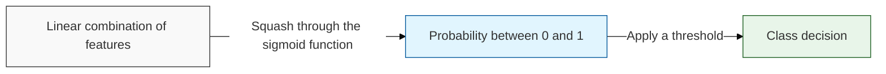
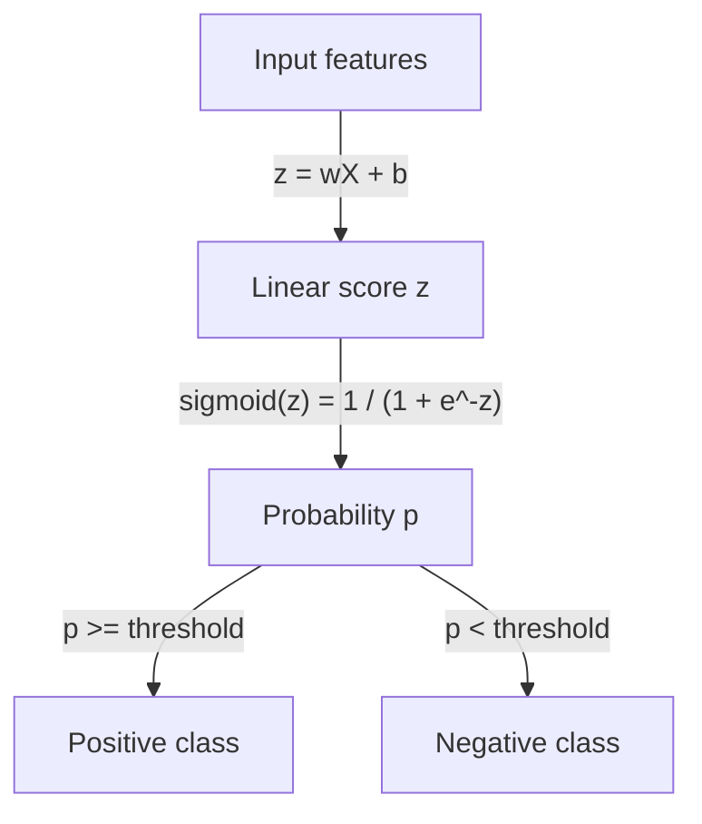

## I. Turning a linear score into a probability — overview of Logistic Regression

**Definition**: despite its name, a **classification** algorithm — it computes a linear score from the input features and passes it through a sigmoid ( **Logistic Function** ) to produce a probability, which a threshold converts into a class

**Characteristics**:
( **Probabilistic Output** ) the result is not just a label but a calibrated confidence, which is what lets a business tune the decision threshold to its own cost of error
( **Linear Decision Boundary** ) the separating surface is a straight line or hyperplane, so overlapping or curved class structures cannot be separated without added features
( **Foundation of Neural Networks** ) a single logistic unit is exactly one neuron — the same sigmoid reappears as an activation function in a [neural network](/docs/infrastructure/models/neural-network/)

## II. Detailed mechanisms and components of Logistic Regression

### A. The inference mechanism of Logistic Regression

### B. Core components and detailed functions

| Component | Detailed Description | Notes |
| :--- | :--- | :--- |
| **Sigmoid Function** | Maps any real number onto the interval (0, 1), converting a linear score into a probability | **Logistic Function** |
| **Log Loss** | The training objective, penalizing confident wrong answers far more heavily than uncertain ones | **Cross-Entropy** |
| **Decision Threshold** | The cutoff separating classes — moving it trades [precision against recall](/docs/infrastructure/models/) rather than improving the model | **Operating Point** |
| **Odds Ratio** | The exponentiated coefficient, read as the multiplicative change in odds per unit of a feature | **Interpretability** |

## III. Technical challenges and trends of Logistic Regression

### A. Limitations and optimization strategies

| Item | Detailed Content | Solution |
| :--- | :--- | :--- |
| **Non-linear Patterns** | Classes that interleave or curve cannot be separated by a hyperplane | Feature engineering, **kernel** methods ( [SVM](/docs/infrastructure/models/svm/) ), tree models |
| **Class Imbalance** | With rare positives the model can score well while never predicting the minority class | Class weighting, resampling, threshold tuning over accuracy |
| **Complete Separation** | When a feature separates the classes perfectly, coefficients diverge to infinity | **L2** regularization |

### B. Technology trends

( **Default Baseline for Classification** ) fraud detection, churn prediction, and spam filtering still begin here, because a probability with an auditable coefficient behind it is often worth more than a marginal accuracy gain.
( **Calibration Layer** ) it is widely reused on top of other models — the outputs of a complex classifier are passed through a logistic fit ( **Platt Scaling** ) to turn uncalibrated scores into usable probabilities.
