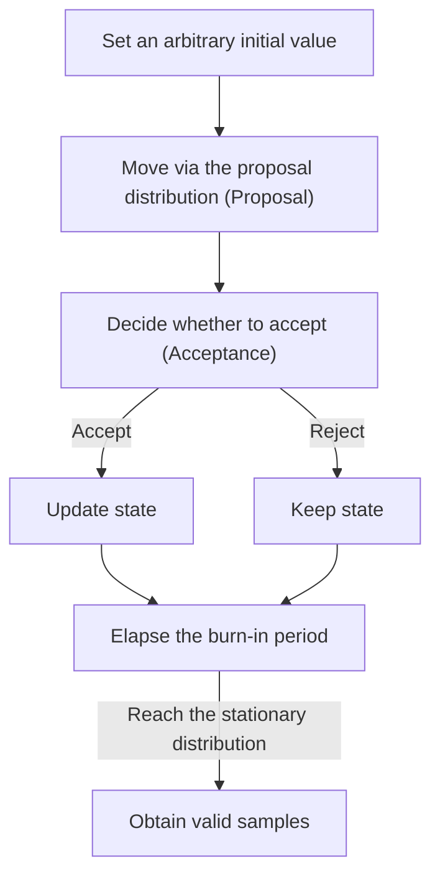

# Markov Chain Monte Carlo (MCMC)

## I. Numerical sampling of complex distributions — overview of MCMC

**Definition**: an algorithm that numerically draws samples from a complex target probability distribution that is difficult to sample directly, by using the stationary distribution of a Markov Chain ( **Markov Chain** )

**Characteristics**:
( **Monte Carlo** ) combines the stochastic methodology of generating random numbers to obtain a numerical approximate solution
( **Memorylessness** ) a chained structure in which the generation of the next sample is determined solely by the state of the current sample
( **High-Dimensional Handling** ) delivers excellent performance when estimating complex multivariate distributions or posterior distributions that cannot be integrated analytically

## II. Detailed mechanisms and components of MCMC

### A. The sampling mechanism of MCMC

### B. Major algorithms and detailed functions

| Algorithm Type | Detailed Description | Notes |
| :--- | :--- | :--- |
| **Metropolis-Hastings** | Proposes a candidate state and decides whether to move based on the probability ratio against the target distribution | The most general-purpose sampling technique |
| **Gibbs Sampling** | In a multivariate distribution, sequentially samples each variable conditioned on the others | Efficient for handling high-dimensional distributions |
| **Hamiltonian MC** | Introduces Hamiltonian dynamics from physics to maximize the exploration efficiency of the sampling path | Substantially improves convergence speed in high dimensions |

## III. Technical considerations and trends in MCMC

### A. Key technical considerations

| Key Element | Detailed Content | Notes |
| :--- | :--- | :--- |
| **Burn-in** | Discards the initial samples generated before convergence to remove bias from the initial value | **Initial Bias Removal** |
| **Mixing Rate** | How quickly and evenly the sampling algorithm explores the target distribution's space | **Convergence Speed** |
| **Autocorrelation** | The degree of correlation between adjacent samples — an indicator of sample independence | **Sample Independence** |

### B. Technology trends

( **Scalable MCMC** ) **SGLD** (Stochastic Gradient Langevin Dynamics), which combines stochastic gradient descent with MCMC, is used for large-scale data processing.
( **Probabilistic Programming** ) probabilistic programming languages such as **Stan** and **PyMC** have popularized MCMC as an automatic sampling tool for complex Bayesian models.
