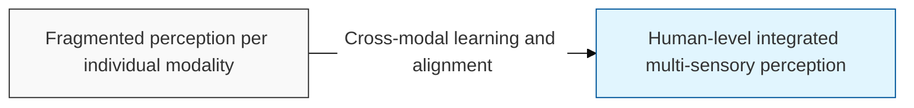
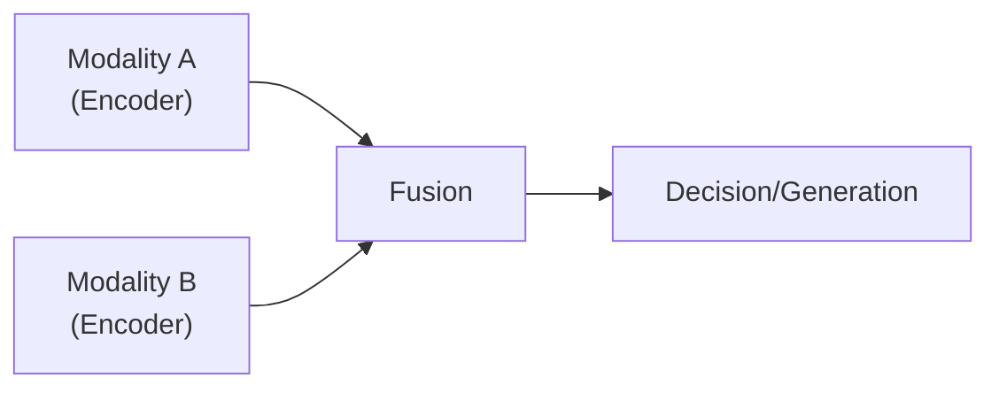

## I. Integrating senses across multiple modalities — overview of Multimodal AI

**Definition**: an artificial intelligence technology that takes in different types of data ( **Modality** ) — text, images, audio, video, and more — simultaneously, identifies the relationships between them, and generates output

**Characteristics**:
( **Cross-Reference** ) performs knowledge transfer across modalities, such as describing the contents of an image in text or generating an image from text
( **Human-like** ) implements human-like cognitive abilities by combining vision, hearing, and language capabilities
( **Joint Embedding** ) maps different types of data into a single, shared numeric space ( **Joint Vector Space** )

## II. Training techniques and architecture of Multimodal AI

### A. Approaches to modality integration

### B. Key technologies and models

| Category | Key Model / Technology | Detailed Description |
| :--- | :--- | :--- |
| **Contrastive Learning** | **CLIP** | Learns to bring semantically similar image-text pairs closer together by contrasting them |
| **Generative Models** | **Stable Diffusion**, **DALL**-**E** | Text-conditioned image generation ( **Text-to-Image** ) |
| **Multimodal LLM** | **GPT**-4o, **Claude** 3.5, **Gemini** | Massive models that integrate image understanding with text reasoning |
| **Video Generation** | **Sora** | Generates video while maintaining spatiotemporal consistency |

## III. Applications and future direction of Multimodal AI

| Item | Detailed Content |
| :--- | :--- |
| **Key Applications** | Autonomous driving (sensors + maps), medical diagnosis (imaging + charts), assistance for the visually impaired, content generation |
| **Core Challenges** | Handling imbalance between modalities, massive computational load, difficulty of data alignment ( **Alignment** ) |
| **Future Outlook** | Evolving into Embodied AI, combined with robotics to understand and interact with the physical environment |

**Technology trends**: recent AI models are increasingly designed as natively multimodal ( **Native Multimodal** ) systems that learn multiple modalities together from the outset, demonstrating even more sophisticated situational awareness
