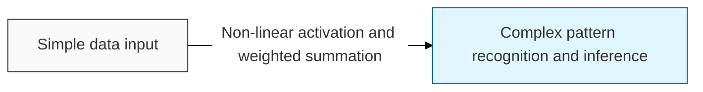
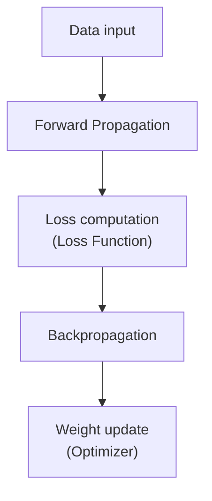

# Neural Network

## I. Combining biological inspiration with mathematics — overview of Neural Network

**Definition**: an artificial neural network algorithm that imitates how neurons operate in the human brain, learning non-linear patterns in data through multiple layers of nodes connected by weights ( **Weights** )

**Characteristics**:
( **Non-linearity** ) able to model complex non-linear relationships through activation functions
( **Universal Approximator** ) theoretically holds the universality ( **Universal Approximator** ) to approximate any complex function
( **Parallel Processing** ) a structure in which many computations can run simultaneously, making it well suited to GPU acceleration

## II. Layer structure and core mechanisms of Neural Network

### A. Signal propagation and the training process of a neural network

### B. Core components and detailed functions

| Category | Key Element | Detailed Description |
| :--- | :--- | :--- |
| **Neuron** (Node) | **Perceptron** | The basic unit that takes an input, multiplies it by a weight, and adds a bias ( **Bias** ) |
| **Activation Function** | **Activation Function** | Transforms the output signal to introduce non-linearity (e.g., **ReLU**, **Sigmoid**, **Softmax**) |
| **Loss Function** | **Loss Function** | Measures the difference between the true value and the predicted value (e.g., **MSE**, **Cross-Entropy**) |
| **Backpropagation** | **Backpropagation** | Propagates the error at the output layer back toward the input layer using the chain rule ( **Chain Rule** ) |
| **Optimization** | **Optimizer** | Updates the weights to minimize loss (e.g., **SGD**, **Adam**, **RMSprop**) |

## III. Limitations and solutions of Neural Network

| Item | Problem (Limit) | Solution |
| :--- | :--- | :--- |
| **Vanishing Gradient** | **Vanishing Gradient** | Use the **ReLU** activation function and apply **Batch Normalization** |
| **Overfitting** | **Overfitting** | **Dropout**, **L1**/**L2 Regularization**, **Early Stopping** |
| **Black Box** | **Explainability** | **XAI** (Explainable AI) techniques and attention ( **Attention** ) map analysis |

**Technology trends**: as neural networks addressed the challenges that arise as they grow deeper, they evolved into **Deep Learning**, and today the **Transformer** architecture serves as the core underlying technology for large language models ( **LLM** )
