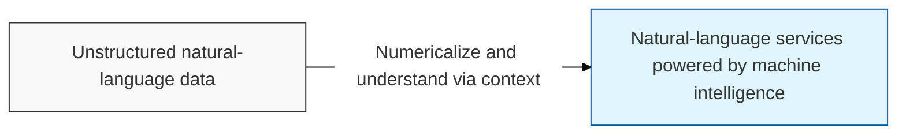
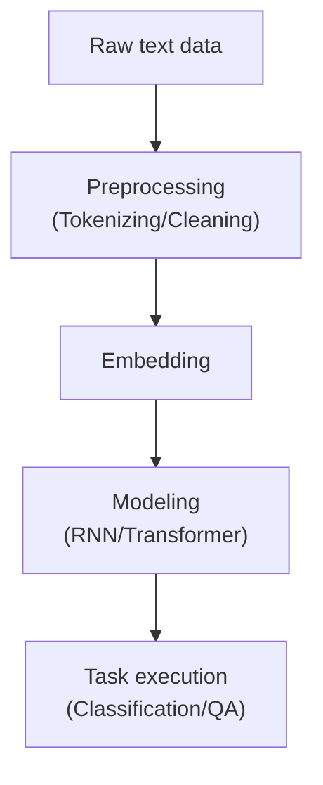

## I. Communication between human language and machines — overview of NLP

**Definition**: a core research field of artificial intelligence that enables computers to understand, analyze, and generate the natural language used by humans

**Characteristics**:
( **Resolving Ambiguity** ) handles the complex characteristics of language, such as word polysemy and meaning that shifts with context
( **Vectorization** ) processes unstructured text data by converting it into numeric vectors ( **Vector** )
( **Understanding and Generation** ) composed of the interplay between natural language understanding ( **NLU** ) and natural language generation ( **NLG** )

## II. Major processing stages and technical elements of NLP

### A. The text-analysis pipeline

### B. Core techniques and methods

| Stage | Key Techniques | Detailed Description |
| :--- | :--- | :--- |
| **Preprocessing** | **Tokenization**, **Stemming**, **Stopword Removal** | Splits text into minimal units and removes noise |
| **Embedding** | **Word2Vec**, **GloVe**, **FastText** | Converts words into dense vectors in a high-dimensional space |
| **Syntactic Analysis** | **POS Tagging**, **NER** (Named Entity Recognition) | Identifies sentence components and extracts key information |
| **Contextual Understanding** | **Attention Mechanism**, **Self-Attention** | Determines correlations between words and assigns importance |

## III. Major tasks and evolution stages of NLP

| Stage | Core Models | Key Characteristics |
| :--- | :--- | :--- |
| **Rule-based** | Regular expressions, dictionary-based methods | Operates only within predefined rules; limited scalability |
| **Statistical** | **N**-**gram**, **TF**-**IDF** | Relies on word frequency and statistical probability |
| **Deep-learning-based** | **RNN**, **LSTM**, **CNN** | Began automatically learning contextual features |
| **Massive Models** | **BERT**, **GPT**, **T5** | General-purpose performance through large-scale pre-training ( **Pre-training** ) |

**Technology trends**: NLP has now fully shifted from small models built for a specific task to the era of large language models ( **LLM** ) capable of performing virtually any language task
