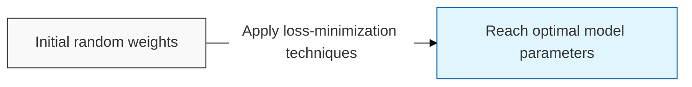
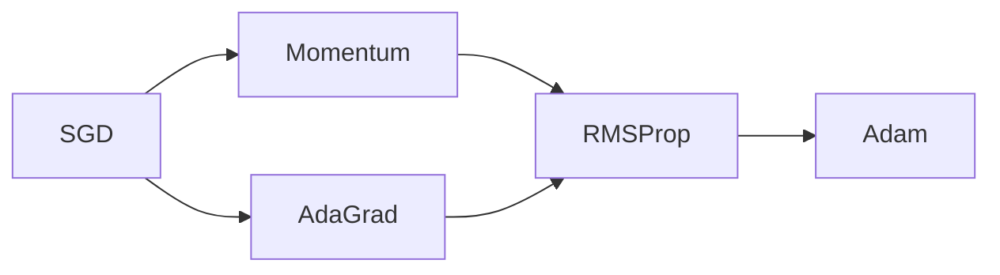

# Optimization

## I. Numerically searching for minimal loss — overview of Optimization

**Definition**: a mathematical methodology that systematically adjusts a model's parameters (weights) to minimize the loss function ( **Loss Function** ), the difference between the model's output and the true value

**Characteristics**:
( **Iterative Update** ) rather than solving for a solution in one step, the optimal solution is searched for by moving incrementally along the gradient ( **Gradient** )
( **Convergence** ) a control technique that reaches the target performance by setting an appropriate learning rate ( **Learning Rate** )
( **Stability** ) secures training stability by avoiding local minima ( **Local Minima** ) and saddle points ( **Saddle Point** )

## II. Major optimization algorithms and mechanisms

### A. The evolutionary lineage of optimizers

### B. Comparison of core optimization techniques

| Algorithm | Characteristic | Detailed Description |
| :--- | :--- | :--- |
| **SGD** | **Stochastic Gradient Descent** | Computes and updates the gradient quickly using only a portion (batch) of the data |
| **Momentum** | Applies inertia | Accelerates in the direction of previous movement to help escape local minima |
| **AdaGrad** | Adjusts the learning rate | Automatically learns less on variables that have changed a lot and more on those that have changed little |
| **Adam** | **Momentum + RMSProp** | A general-purpose optimizer that considers both direction (inertia) and step size (adaptive learning rate) |

## III. Considerations and technical limitations of Optimization

| Item | Detailed Content |
| :--- | :--- |
| **Learning Rate** | Too large and it diverges; too small and convergence becomes excessively slow |
| **Batch Size** | Training stability and generalization performance vary with batch size ( **Generalization Gap** ) |
| **Regularization** | Controls complexity and prevents overfitting through techniques such as weight decay ( **Weight Decay** ) |

**Technology trends**: advanced optimization algorithms such as **AdamW**, **Lion**, and **Adafactor**, which maximize memory efficiency for training large-scale models ( **LLM** ), continue to be actively researched
