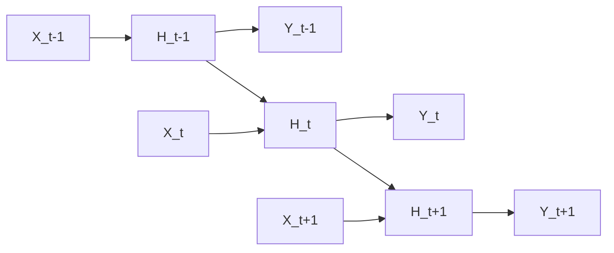

## I. Memory and processing of sequential data — overview of RNN

**Definition**: a neural network in which connections between units form a recurrent structure, reflecting past information in the current computation to process sequential data ( **Sequential Data** ) such as time series or text

**Characteristics**:
( **Variable Length** ) no restriction on input or output length, making it suitable for natural language processing and speech recognition
( **State Retention** ) stores information from previous steps in a hidden state ( **Hidden State** ), effectively serving as a form of memory
( **Parameter Sharing** ) uses the same weights at every time step ( **Time-step** ) to learn temporal patterns

## II. Structural limitations and advanced models of RNN

### A. Unrolling RNNs over time and how they are trained

### B. Major variant models and their characteristics

| Model | Characteristics and Mechanism | Problem Solved |
| :--- | :--- | :--- |
| **Vanilla RNN** | The simplest recurrent structure | Short-term memory problem |
| **LSTM** | Maintains long-term memory via **Forget**/**Input**/**Output Gates** | **Long-term Dependency** |
| **GRU** | A simplified **LSTM** consisting of an update gate and a reset gate | Improved computational efficiency |
| **Bi**-**RNN** | Connected bidirectionally to leverage both past and future information | Improved contextual understanding |

## III. Applications and limitations of RNN

| Item | Detailed Content |
| :--- | :--- |
| **Key Applications** | Machine translation, speech recognition, stock-price prediction, text generation ( **Sequence Generation** ) |
| **Long-term Dependency Problem** | Information from earlier in the sequence is lost as the sequence grows longer ( **Vanishing Gradient** ) |
| **Parallelization Limits** | Results depend on the previous time step, making large-scale parallel computation on a **GPU** difficult |

**Technology trends**: the RNN family was long the standard for processing sequential data, but it has increasingly been replaced across many domains by the **Transformer**, which enables parallel processing and dramatically resolves the long-term dependency problem
