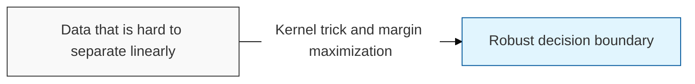
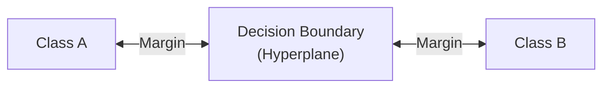

## I. Finding the optimal boundary via margin maximization — overview of SVM

**Definition**: a supervised learning algorithm that performs classification and regression by finding the optimal hyperplane ( **Hyperplane** ) that maximizes the margin ( **Margin** ), the distance between two classes, in the space where the data resides

**Characteristics**:
( **Maximum Margin** ) maximizes the buffer space between the decision boundary and the data, securing strong generalization performance on unseen data
( **Support Vectors** ) performs efficient computation using only the key data points ( **Support Vectors** ) that contribute to forming the decision boundary, rather than the entire dataset
( **Kernel Trick** ) a technique that maps data that cannot be linearly separated in a low-dimensional space into a higher dimension to create a non-linear boundary

## II. Detailed mechanisms and components of SVM

### A. The classification mechanism of SVM

### B. Core components and detailed functions

| Component | Detailed Description | Notes |
| :--- | :--- | :--- |
| **Hyperplane** | The optimal **N**-dimensional plane that separates data into different classes | **Decision Boundary** |
| **Margin** | The perpendicular distance between the support vectors and the decision boundary — an indicator of model robustness | **Distance** |
| **Kernel Function** | Transforms non-linear data into a higher-dimensional space via functions such as **RBF** and **Polynomial** | **Kernel Function** |
| **Slack Variable** | A flexibility parameter that allows some misclassification in order to prevent overfitting | **Soft Margin** (C) |

## III. Key characteristics and technology trends of SVM

### A. Advantages and limitations

| Item | Detailed Content | Notes |
| :--- | :--- | :--- |
| **Key Advantage** | Effective even in high-dimensional spaces and robust against overfitting | **Robustness** |
| **Limitation** | Computational complexity increases on large datasets, and choosing an appropriate kernel can be difficult | **Complexity** |
| **Applications** | High-dimensional data domains such as text classification, image recognition, and biometric analysis | **Application** |

### B. Technology trends

( **Baseline Model** ) it is still used as a powerful classifier that can substitute for deep learning in settings with limited data and many features.
( **Hybrid Approach** ) it is increasingly used as the classifier in the final layer of a neural network, or combined with hyperparameter optimization techniques to boost performance.
