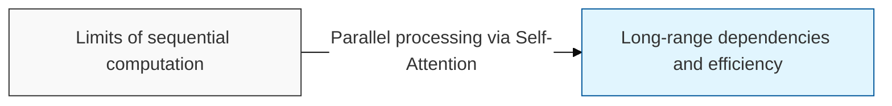
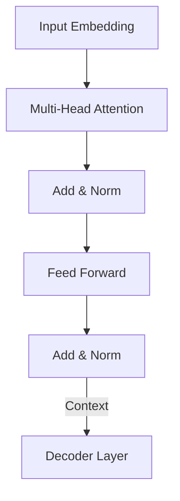

# Transformer

## I. Parallel processing and self-attention — overview of Transformer

**Definition**: an innovative neural network architecture that overcomes the limitations of **RNN**s, which require sequential computation, by processing the relationships between all words in a sentence in parallel through the **Self-Attention** mechanism

**Characteristics**:
( **Parallel Computation** ) takes the entire sequence as input at once, making it optimal for GPU acceleration and large-scale data training
( **Long-term Dependency** ) directly connects relationships between distant words without loss, via the attention mechanism
( **Scalability** ) performance continues to improve as model size (parameters) and data volume increase

## II. Core components and mechanism of Transformer

### A. The encoder-decoder structure and attention flow

### B. Core technical elements

| Component | Detailed Description | Key Role |
| :--- | :--- | :--- |
| **Self-Attention** | Quantifies the relationship each word in a sentence has with every other word | Captures contextual meaning |
| **Multi-Head** | Runs multiple attention operations in parallel to gather information from different perspectives | Extracts richer features |
| **Positional Encoding** | Numerically injects positional information into the Transformer, which otherwise has no notion of order | Preserves sequence order |
| **Residual Connection** | Adds the input to the output so that signals propagate well even as layers get deeper | Ensures training stability |

## III. Impact and future direction of Transformer

| Item | Detailed Content |
| :--- | :--- |
| **Natural Language Processing** | The standard architecture behind virtually every modern **NLP** model, including **BERT** (understanding) and **GPT** (generation) |
| **Multimodal Expansion** | Extended to every domain, including images ( **ViT** ), audio, and video |
| **Limitations and Challenges** | Computation grows quadratically with sequence length (recent research includes **Linear Attention** and similar approaches) |

**Technology trends**: the Transformer has now become the basic backbone of foundation models ( **Foundation Model** ) that go far beyond simple language models, and the large language models ( **LLM** ) built on it are driving a new paradigm in artificial intelligence
