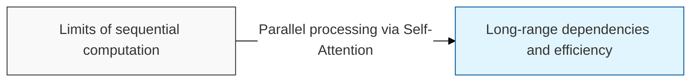
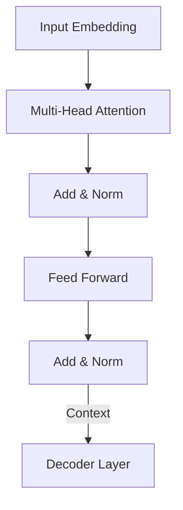
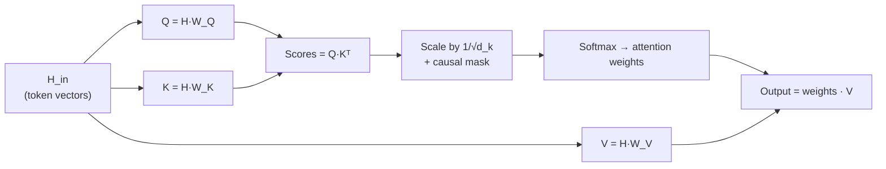

## I. Parallel processing and self-attention — overview of Transformer

```mermaid
%%{init: { 'theme': 'base', 'themeVariables': { 'edgeLabelBackground': '#fff' }}}%%
flowchart LR
    A1["Limits of sequential computation"] -- "Parallel processing via Self-Attention" --> B1["Long-range dependencies and efficiency"]
    style A1 fill:#f9f9f9,stroke:#333,stroke-width:1px
    style B1 fill:#e1f5fe,stroke:#01579b,stroke-width:1px
```

**Definition**: an innovative neural network architecture that overcomes the limitations of **RNN**s, which require sequential computation, by processing the relationships between all words in a sentence in parallel through the **Self-Attention** mechanism

**Characteristics**:
( **Parallel Computation** ) takes the entire sequence as input at once, making it optimal for GPU acceleration and large-scale data training
( **Long-term Dependency** ) directly connects relationships between distant words without loss, via the attention mechanism
( **Scalability** ) performance continues to improve as model size (parameters) and data volume increase

## II. Core components and mechanism of Transformer

### A. The encoder-decoder structure and attention flow

```mermaid
graph TD
    A2["Input Embedding"] --> B2["Multi-Head Attention"]
    B2 --> C2["Add & Norm"]
    C2 --> D2["Feed Forward"]
    D2 --> E2["Add & Norm"]
    E2 -- "Context" --> F2["Decoder Layer"]
```

### B. Core technical elements

| Component | Detailed Description | Key Role |
| :--- | :--- | :--- |
| **Self-Attention** | Quantifies the relationship each word in a sentence has with every other word | Captures contextual meaning |
| **Multi-Head** | Runs multiple attention operations in parallel to gather information from different perspectives | Extracts richer features |
| **Positional Encoding** | Numerically injects positional information into the Transformer, which otherwise has no notion of order | Preserves sequence order |
| **Residual Connection** | Adds the input to the output so that signals propagate well even as layers get deeper | Ensures training stability |

### C. Inside one attention layer — Query, Key, Value

An attention layer takes a sequence of input vectors and returns a sequence of the same length, where every output vector has been rewritten in terms of the other tokens it depends on. The layer holds three learned projection matrices, and multiplying the input by each of them produces the three roles that drive the computation:

```mermaid
graph LR
    H["H_in\n(token vectors)"] --> Q["Q = H·W_Q"]
    H --> K["K = H·W_K"]
    H --> V["V = H·W_V"]
    Q --> S["Scores = Q·Kᵀ"]
    K --> S
    S --> M["Scale by 1/√d_k\n+ causal mask"]
    M --> W["Softmax → attention weights"]
    W --> O["Output = weights · V"]
    V --> O
```

| Role | Projection | Intuition |
| :--- | :--- | :--- |
| **Query** ( **Q** ) | `H · W_Q` | What the current token is looking for |
| **Key** ( **K** ) | `H · W_K` | The index each token advertises about itself |
| **Value** ( **V** ) | `H · W_V` | The content a token hands over once it is attended to |

The layer computes `Attention(Q, K, V) = softmax(Q·Kᵀ / √d_k) · V`, which reads as four steps:

| Step | Operation | Why it is there |
| :--- | :--- | :--- |
| **1. Relevance** | Inner product between the query at position `t` and every key | A large inner product means the two vectors point the same way, i.e. the tokens are related |
| **2. Scaling** | Divide the scores by `√d_k` | Without it the scores grow with dimension and push softmax into a near-one-hot regime, killing the gradient |
| **3. Normalization** | **Softmax** across the row | Turns raw scores into a probability vector — how much of its attention budget position `t` spends on each earlier position |
| **4. Aggregation** | Multiply the weights by **V** | The output is a linear combination of value vectors, so it carries context rather than just the token's own identity |

### D. Causal masking — why a generative model cannot look ahead

A decoder-only model is trained to predict the next token, so at position `t` it must not see positions `t+1` and beyond; otherwise it would read the answer off its own input and learn nothing useful. The whole sequence is still processed in parallel, so the constraint is enforced inside the score matrix rather than by feeding tokens one at a time:

| Stage | What happens to the score matrix |
| :--- | :--- |
| **Raw scores** | A `T × T` matrix in which every position has a score against every other position, future included |
| **Mask** | Add `-∞` to the strictly upper triangle (all future positions) |
| **Softmax** | `exp(-∞) = 0`, so future positions receive exactly zero weight |
| **Result** | Position `t` aggregates only positions `1…t` — the autoregressive property holds by construction |

This is what makes training efficient: one forward pass over a sequence of length `T` yields `T` next-token predictions at once, each one honest about what it was allowed to see.

### E. Multi-head attention — several views of the same sentence

A single attention head produces one weighting per position, which forces one set of projections to represent every kind of relationship at once. Instead, the layer runs `h` heads in parallel, each with its own `W_Q`, `W_K`, `W_V` on a lower-dimensional slice, then concatenates their outputs and passes them through a final output projection `W_O`.

| Property | Detailed description |
| :--- | :--- |
| **Specialization** | Different heads empirically latch onto different signals — syntactic dependencies, coreference, named entities, sentiment-bearing words |
| **Cost neutrality** | Each head works in `d_model / h` dimensions, so `h` heads cost roughly what one full-width head would |
| **Recombination** | Concatenate the head outputs, then apply `W_O` so the layer can mix what the heads found instead of leaving them side by side |

## III. Impact and future direction of Transformer

| Item | Detailed Content |
| :--- | :--- |
| **Natural Language Processing** | The standard architecture behind virtually every modern **NLP** model, including **BERT** (understanding) and **GPT** (generation) |
| **Multimodal Expansion** | Extended to every domain, including images ( **ViT** ), audio, and video |
| **Limitations and Challenges** | Computation grows quadratically with sequence length (recent research includes **Linear Attention** and similar approaches) |

### The O(T²) bottleneck and how it is worked around

Attention has to score every position against every other position, so a sequence of length `T` implies a `T × T` matrix — the cost is `O(T²)` in both compute and memory, and doubling the context quadruples it. Memory is usually the binding constraint first, because naïvely materializing that matrix in GPU high-bandwidth memory dominates the layer's traffic.

| Approach | How it attacks the cost | Trade-off |
| :--- | :--- | :--- |
| **Flash Attention** | Tiles the computation and keeps the score block in on-chip SRAM, so the full `T × T` matrix is never written out | Exact same result, far less memory traffic — now the default kernel |
| **Sparse / Sliding-window Attention** | Each token attends only to a local window or a fixed pattern of positions | Cheaper, but distant dependencies must route through several layers |
| **Linear Attention** | Reorders the products so cost grows linearly with `T` | Approximates the softmax weighting; quality is workload-dependent |
| **KV Cache** | At decoding time, reuses keys and values already computed for earlier tokens | Removes recomputation, but cache size grows linearly with context |

**Technology trends**: the Transformer has now become the basic backbone of foundation models ( **Foundation Model** ) that go far beyond simple language models, and the large language models ( **LLM** ) built on it are driving a new paradigm in artificial intelligence
