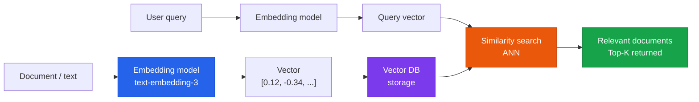

Choosing and tuning vector databases for semantic search

## How a Vector DB Works



## Major Vector DB Comparison

| DB | Hosting | Characteristics | Best fit |
|---|---|---|---|
| **Pinecone** | Managed cloud | Fully managed, easy setup | Rapid prototyping, production |
| **Weaviate** | Self-hosted/managed | Multimodal, hybrid search | Complex queries, open-source preference |
| **Qdrant** | Self-hosted/managed | Rust-based, high performance | Large scale, performance-critical |
| **Chroma** | Self-hosted | Optimized for local development | Dev/test environments |
| **pgvector** | PostgreSQL extension | Integrates with an existing DB | Small scale, simple use cases |

## Key Performance Optimization Metrics

### SLA Targets (Production)
- **P95 response time**: < 100ms
- **P99 response time**: < 200ms
- **Availability**: 99.9%+

### Optimization Points

**1. Embedding Model Selection**
```
text-embedding-3-small: fast, low cost, 1536 dimensions
text-embedding-3-large: higher accuracy, 3072 dimensions
```

**2. Index Configuration**
```
HNSW parameters:
  ef_construction: 128–512 (higher = better accuracy, longer build time)
  M: 16–64 (higher = better accuracy, more memory)
```

**3. Chunking Strategy**
```
Chunk size: 256–512 tokens (adjust based on document type)
Overlap:    50–100 tokens (preserves contextual continuity)
```
